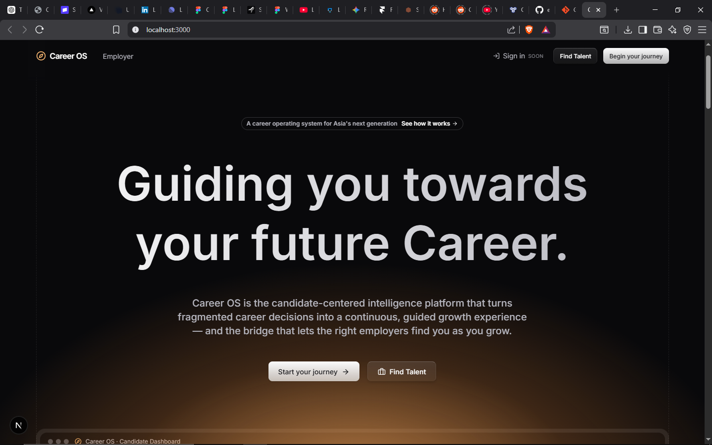
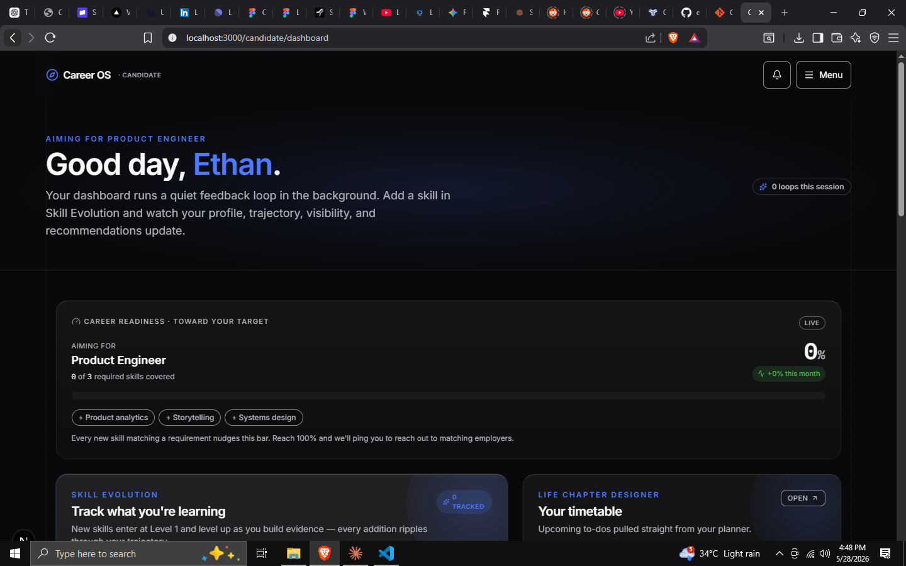
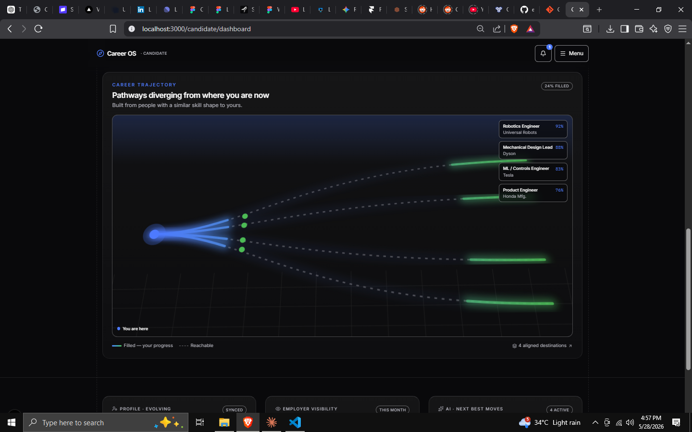
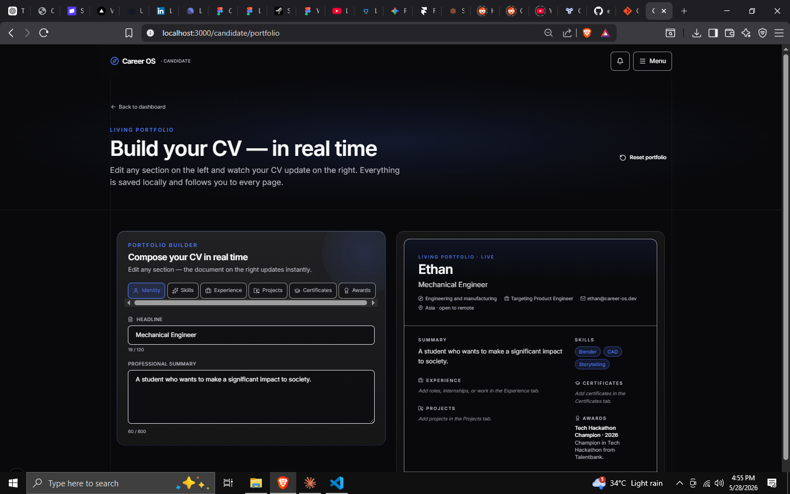
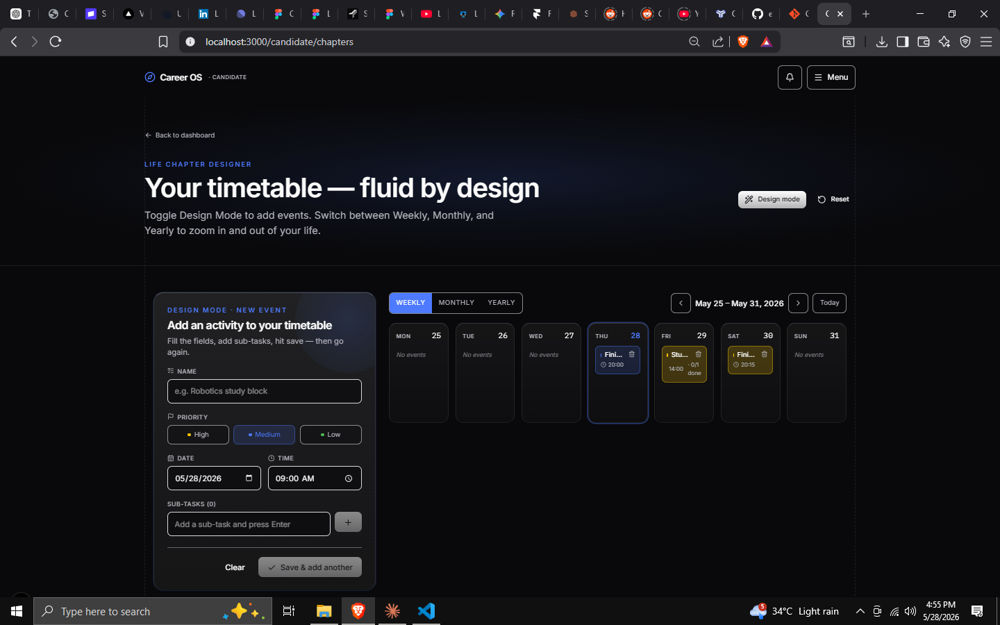
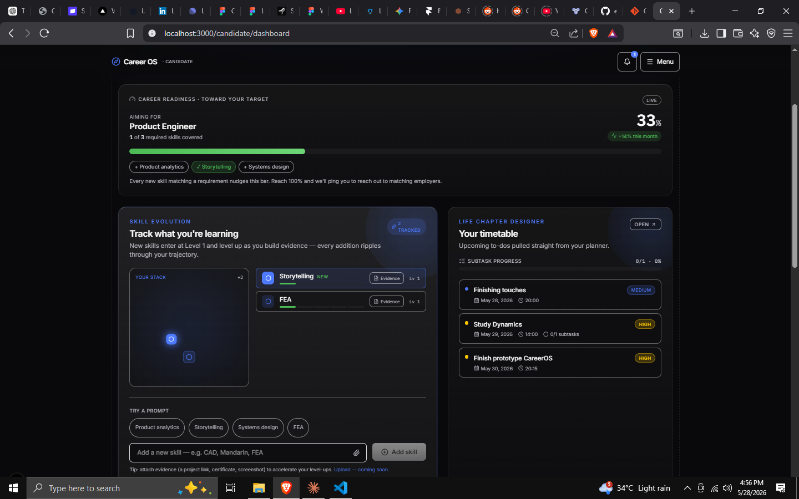
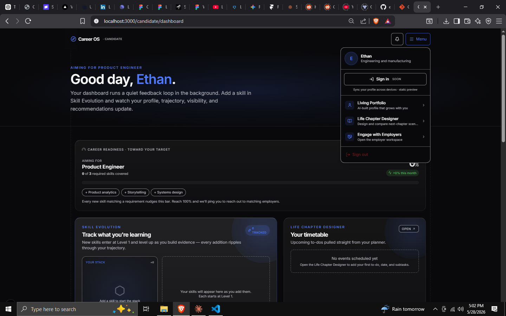

# CareerOS — Candidate Platform
## Product Requirements Document · Project Overview · UX Research Plan

> A lifelong, AI-powered career companion — not another job board.

| | |
|---|---|
| **Document type** | Product Requirements Document (PRD) + Product Discovery + UX Research Plan |
| **Scope** | Candidate Platform only (Employer & University platforms referenced for context, not specified) |
| **Status** | Draft v1.0 — for review by stakeholders, design, and engineering |
| **Date** | 26 June 2026 |
| **Authors (roles represented)** | Senior Product Manager · Senior UX Researcher · Solution Architect · UX Strategist · Technical Product Writer |
| **Source of truth** | This document is grounded in the live CareerOS codebase (Next.js 16 / React 19 / Tailwind v4 / Prisma + Neon Postgres). File references like `src/lib/dashboard/phaseConfig.ts` are real and actionable. |
| **Audience** | Stakeholders · UI/UX designers · Front-end & back-end engineers · Future product planning |

---

## How to read this document

This document is deliberately long because it is intended to be the **single reference** for the Candidate Platform. It is organized into seven parts that map to the five requested deliverables:

| Part | Deliverable | What you'll find |
|---|---|---|
| **A** | Project Overview | Executive summary, vision, mission, principles, audience segments, platform scope |
| **B** | Module Analysis | Deep analysis of all five foundation modules |
| **C** | Candidate Dashboard | The ideal dashboard experience and how modules connect |
| **D** | UX Research Plan | A field-ready interview guide for professionals aged 30–55+ |
| **E** | Feature Evaluation | Every feature scored on value, beneficiaries, and MoSCoW priority |
| **F** | Gap Analysis | Honest assessment vs. LinkedIn, Levels.fyi, Coursera, Duolingo, Notion, and more |
| **G** | Strategic Roadmap | MVP → V2 → 3–5 year vision, AI opportunities, risks, and technical guidance |

> **A note on candor.** Two of the five "foundation" modules — the **AI Career Coach** and the **Fair Pay Engine** — exist today as *concepts and naming*, not as shipped product. The current AI experiences (the Living Portfolio assistant) are **scripted simulations**, not live language-model calls. This document treats that honestly: it specifies what these modules *should* become, rather than describing them as if they already exist. Building on an accurate picture of "what is" is the only way to plan "what's next."

---

## Table of Contents

**Part A — Project Overview**
- A1. Executive Summary
- A2. Vision
- A3. Mission
- A4. The Five Product Principles (the spine of every decision)
- A5. Candidate Audience
- A6. Candidate Platform Scope
- A7. Current Implementation Snapshot (built vs. conceptual)

**Part B — Candidate Module Analysis**
- B1. Career Path Navigator
- B2. Living Portfolio
- B3. AI Career Coach
- B4. Life Chapter Designer
- B5. Fair Pay Engine

**Part C — Candidate Dashboard Overview**

**Part D — UX Research Interview Guide**

**Part E — Feature Evaluation**

**Part F — Candidate Platform Gap Analysis**

**Part G — Strategic Roadmap**

**Appendices** — Glossary · Data model reference · Screenshot index

---
---

# PART A — PROJECT OVERVIEW

## A1. Executive Summary

### What CareerOS is

**CareerOS is a career operating system** — a two-sided (and soon three-sided) intelligence platform that turns the fragmented, anxiety-laden experience of managing a career into a **continuous, guided growth loop**. It is built around a simple but radical reframing:

> A career is not a series of job applications. It is a **40-year arc** of phases, plateaus, and pivots — and it deserves a system designed for that whole arc, not just the moments you are unemployed.

The platform has three planned surfaces:

1. **Candidate Platform** *(the subject of this document)* — a lifelong companion that helps an individual understand where they stand, see the realistic range of paths ahead, build living proof of their abilities, and get found by the right employers at the right moment.
2. **Employer Platform** *(live in prototype)* — a marketplace where employers discover talent **by trajectory** (where someone is heading and how fast they're compounding) rather than by keyword-matching a static résumé.
3. **University Platform** *(future)* — institutional tooling to guide cohorts of students into their first chapters.

The product ships in **dark mode** as a polished, modern SPA, and is positioned as *"a career operating system for Asia's next generation."*

### The vision behind the platform

Today, career tooling is **transactional and episodic**. You ignore LinkedIn until you need a job, blast out résumés, survive a black-box applicant-tracking funnel, accept an offer, and then disappear from the tools until the next time. Nothing accompanies you *between* those panic-driven sprints — the 95% of your career when you are actually *growing*.

CareerOS exists to own that 95%. The vision is a system that is **always on, always learning with you**, that treats every skill learned, project shipped, and reflection logged as a **signal** — and compounds those signals into a living picture of who you are becoming. The product's own landing page states the thesis plainly: *"See where your career is heading."*

### The problem it solves

CareerOS addresses five compounding failures of the status quo:

| # | Problem in the status quo | How it hurts people |
|---|---|---|
| 1 | **Career decisions are made blind.** People can't see the realistic range of paths from where they stand, or the honest trade-offs of each. | Anxiety, analysis-paralysis, regret, and "I wish someone had told me." |
| 2 | **The résumé is a frozen snapshot.** It captures titles, not trajectory; the past, not momentum. | Capable, fast-growing people look identical to stagnant ones on paper. |
| 3 | **Scores and matches are black boxes.** ATS rankings and "match %" give no reason and no recourse. | Distrust, gaming, and qualified people filtered out silently. |
| 4 | **Discovery is mistimed.** Employers find you when keywords align, not when you're genuinely ready and a genuine fit. | Mutual mismatch, wasted interviews, missed opportunities. |
| 5 | **Pay is opaque.** Individuals negotiate without data; the information asymmetry favors employers. | Systematic underpayment, especially for the less-networked. |

### Why it is different from traditional career platforms

| Dimension | Traditional platforms (LinkedIn, Indeed, Jobstreet…) | CareerOS |
|---|---|---|
| **Unit of value** | The job posting / the application | The **person's trajectory over time** |
| **Time horizon** | Episodic (active only during job search) | **Lifelong** (a companion across every phase) |
| **The profile** | A static résumé you periodically update | A **Living Portfolio** that grows from real signals |
| **Guidance** | "Jobs you may like" | A **landscape of realistic paths** with honest trade-offs |
| **Scoring** | Opaque match % / ATS rank | **Fully explainable** readiness, factor by factor |
| **Discovery** | Keyword search of past titles | Found **by direction and momentum**, at the right moment |
| **Personalization** | One-size-fits-all UI | **Six phase-specific dashboards** (student → executive) |

This is the core wedge: **CareerOS is the only platform organized around the whole arc of a career and around making every number it shows you explainable.** That is both its product differentiation and its trust strategy.

---

## A2. Vision

> **To become the lifelong AI-powered career companion that every person — from their first subject choice at 15 to their last board seat at 70 — trusts to help them see clearly, choose wisely, and be found fairly.**

The long-term vision rests on four shifts CareerOS intends to drive:

1. **From episodic tool to lifelong companion.** The product's value compounds the longer you use it. A 17-year-old who starts logging interests, projects, and reflections accumulates a decade of structured career signal by 27 — a moat no résumé can replicate. The system is explicitly modeled as a **six-phase arc** (`student → young_adult → early_career → mid_career → senior_career → executive`, see `src/lib/dashboard/phaseConfig.ts`), each with its own goals, milestones, and dashboard. You never "age out" of CareerOS; you graduate into its next chapter.

2. **From black box to glass box.** Every score, match, and recommendation is decomposable into the human factors that produced it (see the readiness rubric in `src/lib/candidates/readiness.ts`). The vision is a career intelligence layer people *trust* precisely because it never asks them to trust it blindly.

3. **From single answer to landscape.** CareerOS will never tell you "the one right move." It surfaces the **realistic range** of trajectories from where you stand and states what each one gains and gives up (see `src/lib/dashboard/trajectories.ts`). It is a map and a compass, not an autopilot.

4. **From job board to two-sided growth network.** As individuals grow, the right employers discover them — and eventually universities guide whole cohorts in. CareerOS becomes the **translation layer** between human growth and economic opportunity: *"Growth signals in. Discovery out."*

If LinkedIn is the *system of record* for professional identity, CareerOS intends to be the **system of intelligence and intent** for professional growth.

---

## A3. Mission

> **To empower individuals at every stage of their career — not merely to help them find a job, but to help them understand, navigate, and compound a working life they're proud of.**

The mission deliberately rejects the "job board" framing. Finding a job is a *moment*; building a career is the *arc*. CareerOS commits to four things on behalf of every candidate:

- **Clarity over noise.** Turn the overwhelming, contradictory career-advice landscape into a personalized, legible view of *your* situation and *your* options.
- **Evidence over claims.** Help people build a living, AI-readable body of proof — so they are evaluated on what they can demonstrably do and where they're heading, not on how well they wrote a résumé.
- **Agency over algorithms.** Keep humans in the driver's seat. AI advises, explains, and accelerates; it never decides for the person or hides its reasoning.
- **Fairness over asymmetry.** Give individuals the pay data, discovery timing, and transparent scoring that have historically been the employer's advantage.

Every feature in this document is justified against this mission. If a feature doesn't help a person *understand, navigate, or compound* their career — or doesn't make the system *more fair, more legible, or more lifelong* — it is a candidate for cutting.

---

## A4. The Five Product Principles

CareerOS already encodes a set of product principles directly in its source code comments (principles #1–#4 are cited across `trajectories.ts`, `readiness.ts`, `match.ts`, and `discovery/route.ts`). These are not marketing slogans; they are **design constraints** that any new feature must respect. This document formalizes them and adds a fifth.

| # | Principle | Practical constraint on every feature |
|---|---|---|
| **1** | **See the landscape, not a single answer.** Surface the realistic *range* of trajectories and explain the trade-offs of each. | No feature may present "the one correct path." Always show options with honest gains/give-ups. |
| **2** | **A career is a 40-year arc** with phases, plateaus, and pivots. | Features must work across all six phases (or explicitly declare their phase scope). |
| **3** | **Speak human language back to humans.** No black-box scores, no false precision. | Every number must be decomposable into plain-language factors the user can see and act on. |
| **4** | **Connect both sides.** Candidates should be *findable at the right moment*; employers should see *why* a match makes sense. | Discovery is opt-in and explainable on both sides; matches carry their evidence. |
| **5** | **Lifelong, low-pressure, and private by default.** *(Added)* The companion should reduce anxiety, not manufacture it, and the user owns their data and their visibility. | Discovery is off by default (`CandidateProfile.discoverable = false`); engagement loops must avoid dark patterns. |

> **Why this matters for the PRD:** these five principles are the rubric used in **Part E (Feature Evaluation)** and **Part F (Gap Analysis)**. A feature that violates Principle #3 (e.g., an opaque "AI career score") is rejected no matter how engaging it tests.

---

## A5. Candidate Audience

CareerOS is unusual in serving the **entire career arc**, so its audience is not one persona but a **sequence of personas** a single user moves through over decades. The platform already models this as six phases with age bands and distinct goals (`src/lib/dashboard/phaseConfig.ts`). Below, each segment is profiled with goals, pain points, motivations, and the specific CareerOS response.

> **Strategic note:** The richest near-term product-market fit is the **18–34 band** (young adult + early career) — they are forming professional identity, actively job-seeking, and most receptive to AI guidance. The **35–55+ band** (the focus of the Part D research) is the *highest-value and least-served* segment and the key to proving "lifelong." Students are the long-game moat.

### Segment 1 — Students (age ~13–17, phase `student`)

- **Goals:** Discover interests; understand what paths even exist; produce a first small "proof of skill."
- **Pain points:** Overwhelming and abstract choices; advice aimed at adults; no vocabulary for careers; fear of "choosing wrong" forever.
- **Motivations:** Curiosity, identity formation, social proof, low-stakes exploration.
- **How CareerOS helps:** The Student dashboard centers on **exploration tools, subject logs, and early skill tracking** (see `phaseConfig.ts`). Milestones are gentle: *"Select a general field or direction"* and *"Start early proof of a skill."* The message is *discover*, not *decide*.

### Segment 2 — Fresh Graduates & Internship Seekers (age ~18–22, phase `young_adult`)

- **Goals:** Build a portfolio; map target roles to required skills; reach **application/internship readiness**.
- **Pain points:** "No experience" catch-22; don't know what employers actually want; résumé anxiety; invisible to recruiters.
- **Motivations:** Landing a first real role; proving themselves; reducing uncertainty.
- **How CareerOS helps:** The Young Adult dashboard surfaces **target-role metrics, skill mapping (have vs. need), and portfolio completeness (internship-ready %)**. The Living Portfolio turns scattered coursework and projects into AI-readable evidence; readiness scoring shows exactly what's missing.

### Segment 3 — Early-Career Professionals (age ~23–34, phase `early_career`)

- **Goals:** Land the *right* job (not just *a* job); grow market value; run a job search like a pipeline.
- **Pain points:** Application black holes; no feedback on rejections; unsure if they're underpaid or on track; juggling many applications.
- **Motivations:** Momentum, compensation growth, status, optionality.
- **How CareerOS helps:** Dashboard focus on a **job pipeline (Applied → Offer Kanban), active applications, and market-value tracking**. This is the phase where the **Fair Pay Engine** and a true **AI Career Coach** deliver the most value (see Parts B & E).

### Segment 4 — Mid-Career Professionals (age ~35–44, phase `mid_career`)

- **Goals:** Prevent stagnation; deepen a specialization or branch into leadership; future-proof against skill decay.
- **Pain points:** The "plateau"; fear of obsolescence (especially vs. AI/automation); golden-handcuffs inertia; no time to retool.
- **Motivations:** Relevance, security, meaning, the next rung.
- **How CareerOS helps:** Dashboard surfaces **skill-deprecation risk, specialization tracking, and leadership-branch options (IC vs. manager)**. Trajectories explicitly include *"Reinvent before a plateau."* This segment is a core focus of the **Part D research**.

### Segment 5 — Career Switchers (cross-cutting, any age)

- **Goals:** Translate existing skills into a new field; understand switching costs; rebuild credibility efficiently.
- **Pain points:** "Starting over" anxiety; transferable-skills blindness; financial risk; ageism on the far side.
- **Motivations:** Alignment, energy, escape from a bad fit, higher ceiling.
- **How CareerOS helps:** This is a **first-class use case**, not an edge case. The onboarding intent flow includes *"Career change"* as a stage (`src/components/intent-form/data.ts`); trajectory options include *"Pivot domain, keep the skill."* The Life Chapter Designer lets switchers **simulate and compare** parallel futures before committing.

### Segment 6 — Experienced Professionals (age ~30–55+, phases `mid_career` → `senior_career`)

- **Goals:** Convert experience into influence — leadership, advisory seats, mentorship, exec readiness.
- **Pain points:** Career tools feel built for 25-year-olds; networks plateau; unsure how to package decades of impact; "what's next after the next promotion?"
- **Motivations:** Legacy, autonomy, compensation, impact, identity beyond a title.
- **How CareerOS helps:** Senior Career dashboard surfaces **leadership metrics, advisory-board tracking, and a mentorship hub.** *(This segment's real needs are exactly what Part D is designed to validate, because they are the least-served by existing tools.)*

### Segment 7 — Senior Professionals & Executives (age ~55+, phase `executive`)

- **Goals:** Convert a lifetime of experience into legacy and influence — board seats, consulting, master mentorship.
- **Pain points:** Existing platforms assume you're job-hunting; no tooling for portfolio careers or graceful wind-down; experience under-monetized.
- **Motivations:** Meaning, legacy, flexibility, staying engaged on their own terms.
- **How CareerOS helps:** The Executive dashboard centers on **board seats, a consulting pipeline, master mentorship, and legacy metrics.** Trajectories include *"Legacy & institution-building"* and *"Gradual, intentional wind-down."*

### Audience summary

| Segment | Phase | Age | Primary job-to-be-done | Highest-leverage CareerOS module |
|---|---|---|---|---|
| Students | `student` | 13–17 | Explore & discover | Career Path Navigator (exploration mode) |
| Graduates / Interns | `young_adult` | 18–22 | Become application-ready | Living Portfolio + Readiness |
| Early-career | `early_career` | 23–34 | Land the right job, grow value | Job Pipeline + Fair Pay Engine + Coach |
| Mid-career | `mid_career` | 35–44 | Avoid stagnation, plan next move | Navigator (risk & branches) + Coach |
| Career switchers | any | any | Pivot with eyes open | Life Chapter Designer (simulate paths) |
| Experienced | `mid`→`senior` | 30–55+ | Turn experience into influence | Navigator + Mentorship hub |
| Executives | `executive` | 55+ | Convert experience into legacy | Board/consulting/legacy tools |

---

## A6. Candidate Platform Scope

This section gives a complete, plain-language overview of what the Candidate Platform *is* — what users can do, the end-to-end journey, where AI assists, and how the modules connect into one ecosystem.

### What a candidate can do (capability map)

1. **Sign up & establish identity** — first-party auth (email + password), JWT session cookie, candidate role. *(Live.)*
2. **Complete guided onboarding** — a multi-step "intent" flow plus an advanced 5-step questionnaire (Stage → Discovery → Growth → Progression → Feedback) that captures the rich signal driving personalization (`CandidatesAI` model). *(Live.)*
3. **Land in a phase-specific dashboard** — one of six dashboards selected automatically from their career stage. *(Live.)*
4. **See their trajectory** — a visual "pathways diverging from where you are now" diagram plus a landscape of realistic next moves with honest trade-offs. *(Live.)*
5. **Build a Living Portfolio** — a conversational, real-time CV/portfolio builder that sorts what they say into the right sections. *(Live; AI currently scripted.)*
6. **Track skills & readiness** — add skills and watch a transparent, factor-by-factor readiness score update. *(Live.)*
7. **Work the transition milestones** — a "Gatekeeper Checklist" of criteria required to advance to the next phase, partly auto-derived from real data. *(Live.)*
8. **Design & compare life chapters** — a fluid timetable plus scenario planning to simulate parallel futures. *(Live.)*
9. **Opt into discovery** — choose to be projected into the employer marketplace, on their own terms (off by default). *(Live.)*
10. **Manage account, privacy & settings** — edit answers (via `?edit=1`), control discovery, delete account with cascade. *(Live.)*
11. **Receive notifications** — skill, system, and job-match alerts. *(Live.)*
12. **Message employers** — placeholder today; the candidate↔employer chat bridge is intentionally not yet wired. *(Conceptual.)*
13. **Get coached & benchmark pay** — the **AI Career Coach** and **Fair Pay Engine** are foundation concepts not yet built. *(Conceptual.)*

### The complete candidate journey

```
        ┌─────────────┐   ┌──────────────┐   ┌──────────────────┐   ┌─────────────────────┐
        │   Discover   │   │   Onboard    │   │  Understand &     │   │   Build & Prove      │
        │  (landing)   │──▶│ intent + 5-  │──▶│  Orient           │──▶│  Living Portfolio,   │
        │  "See where  │   │ step deep    │   │  phase dashboard, │   │  skills, readiness   │
        │  you're      │   │ questionnaire│   │  trajectory map   │   │                      │
        │  heading"    │   │              │   │                   │   │                      │
        └─────────────┘   └──────────────┘   └──────────────────┘   └──────────┬──────────┘
                                                                                  │
        ┌─────────────────────┐   ┌────────────────────┐   ┌────────────────────▼──────────┐
        │   Grow & Compound    │   │  Decide & Simulate  │   │   Be Found / Reach Out         │
        │  coach, learning,    │◀──│  Life Chapter        │◀──│  opt into discovery; employers │
        │  milestones, pay     │   │  Designer; compare   │   │  surface you by trajectory     │
        │  benchmarks          │   │  parallel futures    │   │                                │
        └──────────┬──────────┘   └────────────────────┘   └────────────────────────────────┘
                   │
                   └──────────▶  (loop forever — phase transitions, new chapters, lifelong)
```

The journey is a **loop, not a funnel.** The "exit" of a job-board funnel is "you got hired and left." The CareerOS loop has no exit — completing a phase transitions you into the next dashboard, and the companion continues.

### How AI assists throughout

| Journey stage | AI's role (intended) | Status today |
|---|---|---|
| Onboarding | Synthesize answers into a personalization summary (`dashboardPersonalizationSummary`) | Field exists; generation is basic |
| Orient | Generate the trajectory landscape & explain trade-offs | Static, curated per phase (transparent by design) |
| Build portfolio | Conversationally extract and sort signal into sections | **Scripted simulation** (no live LLM) |
| Readiness | Decompose a score into human factors | **Live & transparent** (deterministic rubric) |
| Coach | Proactive guidance, mock interviews, résumé feedback | **Not built** |
| Pay | Benchmark, explain ranges, coach negotiation | **Not built** |
| Discovery | Explain *why* a candidate↔employer match makes sense | Live on employer side; explainable matches |

### How modules connect into one ecosystem

The modules are not silos; they share one data spine (`CandidateProfile` + `CandidatesAI` + portfolio collections) and feed each other:

- The **Living Portfolio** is the **source of evidence**. Skills and projects added there feed **readiness scoring**, the **Navigator's** milestones, and the **employer marketplace** projection.
- The **Career Path Navigator** is the **orientation layer**. It reads portfolio + onboarding signals to place you in a phase, show your trajectory, and define the milestones that gate your next phase.
- The **Life Chapter Designer** is the **decision layer**. It lets you simulate futures the Navigator surfaces before you commit real effort.
- The **AI Career Coach** *(future)* is the **connective tissue** — the always-present advisor that reads all of the above and turns insight into a next action.
- The **Fair Pay Engine** *(future)* is the **fairness layer** that attaches a compensation reality-check to every role, trajectory, and offer.

> **One sentence:** *The Portfolio proves who you are, the Navigator shows where you can go, the Chapter Designer lets you rehearse the choice, the Coach helps you act, and the Pay Engine keeps it fair — all reading from one living profile.*

---

## A7. Current Implementation Snapshot

An honest "what is built" baseline, so design and engineering plan from reality.


*Figure A7-1 — The marketing landing page. Positioning: "the candidate-centered intelligence platform that turns fragmented career decisions into a continuous, guided growth experience."*


*Figure A7-2 — The candidate dashboard home ("Good day, Ethan"). Note the phase-aware framing, the target-role card, Skill Evolution, and the Life Chapter timetable preview.*

| Module / Area | Status | Evidence in code |
|---|---|---|
| First-party auth + session | ✅ Live | `src/lib/auth/*`, `/api/auth/*` |
| Onboarding (intent + 5-step deep) | ✅ Live | `src/app/candidate/onboarding/page.tsx`, `CandidatesAI` |
| Six phase-specific dashboards | ✅ Live | `src/components/dashboard/phases/*` |
| Career Path Navigator (trajectory + milestones) | ✅ Live | `TrajectoryDiagram.tsx`, `trajectories.ts`, `phaseConfig.ts` |
| Living Portfolio (CV builder) | ✅ Live | `src/app/candidate/portfolio`, `PortfolioBuilder.tsx` |
| — its AI assistant | ⚠️ Scripted | `ConversationPanel.tsx` (setTimeout, fixed `conversationFlow`) |
| Transparent readiness scoring | ✅ Live | `src/lib/candidates/readiness.ts` |
| Life Chapter Designer (timetable + compare) | ✅ Live | `src/app/candidate/chapters`, `TimetableViews.tsx`, `CompareView.tsx` |
| Notifications | ✅ Live | `CandidateNotification`, `/api/me/notifications` |
| Settings / privacy / account delete | ✅ Live | `src/components/settings/*`, `/api/account` |
| Marketplace discovery (opt-in projection) | ✅ Live | `/api/me/discovery`, `Candidate` model |
| Candidate ↔ employer messaging | 🔲 Placeholder | `/candidate/messages` (empty state by design) |
| **AI Career Coach** | 🔲 Concept | No route/model |
| **Fair Pay Engine** | 🔲 Concept | Referenced only as a label |

**Legend:** ✅ Live · ⚠️ Live but simulated/limited · 🔲 Not yet built.

> The takeaway for planning: the **orientation and evidence layers are genuinely built and good.** The **intelligence (Coach) and fairness (Pay) layers are greenfield** — which is precisely where the next investment and the boldest differentiation lie.

---
---

# PART B — CANDIDATE MODULE ANALYSIS

Each of the five foundation modules is analyzed against a consistent template: **Purpose · Problem · User journey · Core functionality · AI functionality · Required data · Inputs · Outputs · Benefits · Future expansion.** Where a module is conceptual, the analysis specifies what it *should become* and labels assumptions clearly.

---

## B1. Career Path Navigator


*Figure B1-1 — The Navigator's trajectory diagram: a single "you are here" node fanning into multiple realistic destinations, each with an aligned-role label and a fill/reachable state. This is Principle #1 made visual.*

### Purpose
The orientation layer of CareerOS. It answers the two questions that cause the most career anxiety: **"Where am I, really?"** and **"What are my realistic options from here?"** — and it answers them *honestly*, as a landscape of trade-offs rather than a single prescribed path.

### Problem it solves
People make career decisions blind. They can't see the range of paths available from their exact position, can't weigh the trade-offs, and can't tell whether they're progressing or plateauing. Generic advice ("follow your passion," "learn to code") ignores their specific phase and signals. The Navigator replaces blindness with a personalized, legible map.

### User journey
1. After onboarding, the candidate is auto-placed into one of six **phases** (from `CandidatesAI.careerStage`).
2. The dashboard greets them with a **phase-appropriate goal header** (e.g., young adult → *"Build portfolio and internship readiness"*).
3. A **PhaseIndicator** shows their progress through the current phase and what's next.
4. The **trajectory diagram** renders "pathways diverging from where you are now," built from people with a similar skill shape.
5. A **TrajectoriesPanel** lists realistic next moves, each with a time horizon and explicit *"Gain / Give up"* trade-offs.
6. A **GatekeeperChecklist** shows the milestones required to transition to the next phase — some auto-checked from real data, some manually tracked.
7. As the candidate adds skills/projects, milestones tick toward completion and the phase progress advances.

### Core functionality
- **Phase engine** — six phases with distinct goals, focus widgets, and accents (`PHASE_CONFIG` in `phaseConfig.ts`); one route renders all six via a Registry Pattern.
- **Trajectory visualization** — the diverging-paths diagram (`TrajectoryDiagram.tsx`).
- **Trajectory landscape** — curated, trade-off-heavy options per phase (`getTrajectories()` in `trajectories.ts`).
- **Transition milestones** — `TransitionMilestone[]` per phase with optional `derive()` predicates that read live portfolio/onboarding data (`useMilestoneProgress.ts`).
- **Phase progress** — a single shared progress instance feeds both the indicator and the checklist (`MilestonesContext`).

### AI functionality
- **Today:** the trajectory options are **curated static content per phase** — a deliberate choice for transparency (Principle #3). Milestone completion is **deterministically derived** from real signals.
- **Intended:** an AI layer that (a) generates *personalized* trajectory options from the user's actual skill graph and labor-market data rather than a fixed list; (b) estimates the *probability and time* of reaching each destination with stated uncertainty; (c) explains, in plain language, *why* a given path fits this person now. Crucially, the AI must keep showing **a range with trade-offs**, never collapse to one answer.

### Required data
- `CandidatesAI.careerStage` (the phase — source of truth), `targetRoles`, `interestedIndustries`, `currentSkills`, `skillLevels`, `desiredNextMove`, `longTermGoal`, `timeline`, `mainBlocker`.
- Portfolio summary (`projectCount`, `experienceCount`, `skills`, `awardCount`) for milestone derivation.
- *(Future)* labor-market data: role adjacency graphs, skill-demand trends, transition-frequency data.

### Inputs
Onboarding answers; skills/projects added in the Living Portfolio; manual milestone ticks; (future) the user picking/saving a trajectory of interest.

### Outputs
The phase placement and goal header; the trajectory diagram; the ranked list of realistic moves with trade-offs; the milestone checklist with progress %; the "next phase" preview.

### Benefits
- **User:** reduces anxiety and analysis-paralysis; gives a sense of direction and momentum; makes "what's next" concrete and achievable.
- **Business:** the core differentiator and retention driver — the reason to return between job searches; generates the structured signal that powers discovery.

### Future expansion opportunities
- **Personalized, model-generated trajectories** grounded in real labor-market adjacency data.
- **"What would it take?" simulation** — pick a destination and the Navigator back-solves the skills, time, and milestones required.
- **Plateau & skill-decay alerts** for mid-career (the `risk-matrix` focus widget is scaffolded but not yet a live analysis).
- **Peer benchmarking** — "people with your shape who reached X did these three things."
- **Integration with the Fair Pay Engine** so each trajectory shows its compensation landscape.

---

## B2. Living Portfolio


*Figure B2-1 — The Living Portfolio: a conversational assistant on the left captures your story; a structured, employer-ready CV assembles itself on the right in real time.*

### Purpose
The evidence layer. It transforms the dreaded, static résumé into a **living, AI-readable body of proof** that grows continuously from real signals — skills learned, projects shipped, reflections logged — and stays current without a "rewrite my résumé" project.

### Problem it solves
Résumés are frozen snapshots that reward writing ability over real ability, decay the moment they're written, and flatten fast-growing people to look identical to stagnant ones. They also can't be read well by machines for fair matching. The Living Portfolio fixes all four: it's continuous, evidence-based, momentum-aware, and structured for AI consumption.

### User journey
1. Candidate opens **Living Portfolio** ("Build your CV — in real time").
2. A **Portfolio assistant** greets them and asks one human question at a time (*"In one sentence, who are you and what do you do right now?"*).
3. The candidate answers naturally; the assistant confirms and **sorts the answer into the correct CV section** (bio → headline, a project → experience, a skill → skills, etc.).
4. The **right-hand CV preview updates live** as each answer lands.
5. The flow walks through bio → experience → skill → aspiration → reflection, then invites open-ended additions ("add a new skill, project, goal, or thought — I'll sort it").
6. Everything is saved and feeds readiness, the Navigator, and (if discoverable) the marketplace.

### Core functionality
- **Split-screen builder** — conversation panel + live CV preview (`PortfolioBuilder.tsx`, `ConversationPanel.tsx`, `CVPreview.tsx`).
- **Section routing** — each answer targets a `PortfolioSection` (`bio | skill | experience | aspiration | reflection`) and is appended via `usePortfolio().addItem()`.
- **Structured collections** — `Certificate`, `Award`, `Project`, `Experience` models hang off `CandidateProfile`.
- **Additions tracking** — `totalAdditions` and `lastUpdated` quantify "living-ness."
- **Cache-first hydration** — paints instantly from localStorage, then reconciles with the server.

### AI functionality
- **Today (honest):** the assistant is a **scripted simulation** — a fixed `conversationFlow` with `setTimeout`-based "thinking," not a live language model. It always routes the *bio* answer to the headline, the *experience* answer to experience, etc., regardless of what the user actually typed.
- **Intended:** a genuine LLM that (a) **classifies free-form input** into the right section(s) even when the user volunteers things out of order; (b) **extracts structured entities** (skills, dates, metrics, tools) from a messy paragraph; (c) **rewrites for impact** while preserving truth ("led migration" → quantified bullet); (d) **interviews proactively** to fill gaps the readiness model flags; (e) generates tailored variants of the portfolio for a specific target role.

### Required data
- `CandidateProfile`: `headline`, `summary`, `skills[]`, `bio`, plus child collections (`projects`, `experiences`, `certificates`, `awards`).
- `totalAdditions`, `lastUpdated` for the "living" signal.
- Linkage to `CandidatesAI` for aspirations/target roles.

### Inputs
Natural-language messages in the assistant; direct edits to CV sections; (future) imported LinkedIn/PDF résumé, GitHub/Behance/Dribbble links, uploaded certificates.

### Outputs
A structured, employer-ready CV/portfolio; the data spine that feeds readiness scoring, the Navigator's milestones, and the marketplace projection; a timestamped record of growth.

### Benefits
- **User:** removes résumé-writing dread; always up to date; turns ordinary work into compelling, structured evidence; one portfolio, many uses.
- **Business:** generates the **highest-quality structured candidate data** in the system — the asset that makes explainable matching and discovery possible; a strong daily/weekly engagement hook.

### Future expansion opportunities
- **Real LLM extraction & impact-rewriting** (the single highest-ROI AI upgrade in the platform).
- **Evidence verification** — link a project to a live URL/repo; employer-verifiable claims.
- **Role-targeted exports** — generate a tailored CV/portfolio for a specific application in one click.
- **Skill auto-detection** from connected sources (GitHub commits, design files, course completions).
- **Public, shareable portfolio page** with a vanity URL — a candidate's "home on the internet."
- **Verifiable credentials** integration for certifications.

---

## B3. AI Career Coach

> **Status: conceptual.** No route or model exists today; the only conversational AI in the product is the scripted Living Portfolio assistant. This section specifies what the Coach *should be*. It is, in our assessment, the **most important unbuilt module** — the connective intelligence that makes everything else feel alive.

### Purpose
The intelligence layer and the platform's "always-on" presence: a proactive, context-aware advisor that reads the candidate's entire CareerOS picture (phase, portfolio, readiness, trajectory, chapters, goals) and turns it into **timely, specific, human guidance and action** — the difference between a dashboard you *check* and a companion that *accompanies you*.

### Problem it solves
Insight without action is just more anxiety. Candidates can see their readiness and their options but still don't know *what to do this week*. Professional coaching is effective but expensive and inaccessible to most. The AI Career Coach democratizes high-quality, personalized career coaching and collapses the gap between "I understand my situation" and "I'm acting on it."

### User journey (intended)
1. The Coach is reachable from anywhere (persistent entry point in the shell) and also **surfaces proactively** ("You added 3 robotics skills this month — you're now 1 skill from the Robotics Engineer threshold. Want a 2-week plan?").
2. The candidate can ask anything: *"Am I underpaid?", "Should I take the manager track?", "Review my portfolio for a UX role," "Run a mock interview."*
3. The Coach responds **with the user's real context and cited reasoning**, never generically.
4. It can **take actions**: draft a portfolio bullet, add a milestone, generate a learning plan, prep interview questions, or hand off to the Fair Pay Engine.
5. It checks back in (with consent) on commitments the user made.

### Core functionality (intended)
- **Context-grounded chat** over the full candidate graph (RAG across portfolio, onboarding, readiness, trajectories, chapters).
- **Proactive nudges** triggered by events (skill added, milestone met, phase transition, market shift) — respecting Principle #5 (no anxiety-manufacturing dark patterns).
- **Skill modes:** résumé/portfolio review · mock interviews (role-specific) · learning-path generation · decision support (trade-off framing, never a single verdict) · negotiation prep (with Fair Pay data).
- **Action-taking** via tool calls into existing APIs (add skill, create chapter event, update milestone).
- **Memory** of the user's goals, preferences, and prior advice.

### AI functionality
This module *is* AI. Recommended technical shape: a **Claude-powered agent** (the codebase already standardizes on Claude models) with tool use over the CareerOS API surface, retrieval over the candidate's structured profile, and strict **explainability** (every recommendation cites the signals behind it, per Principle #3). Guardrails: no fabricated facts about the user; uncertainty stated; human-in-the-loop for consequential actions.

### Required data
The entire candidate graph: `CandidateProfile` + collections, `CandidatesAI`, readiness breakdown, current phase + milestones, trajectories, chapter events, notifications. *(Future)* labor-market and compensation data; interview question banks per role.

### Inputs
User messages; proactive event triggers; the candidate's full context; (future) market data and job descriptions the user is targeting.

### Outputs
Conversational guidance with cited reasoning; concrete actions taken in-app; generated artifacts (learning plans, interview prep, rewritten bullets, negotiation scripts); proactive, dismissible nudges.

### Benefits
- **User:** affordable, always-available, deeply personalized coaching; insight becomes action; reduced anxiety through a trusted guide.
- **Business:** the **primary engagement and retention engine** and the most defensible differentiator; the natural home for a future premium tier; the feature most likely to create emotional attachment ("my coach").

### Future expansion opportunities
- **Voice coaching** and mock interviews with spoken delivery feedback.
- **Multimodal portfolio review** (read a design file, a repo, a slide deck).
- **Long-horizon accountability** — a quarterly "career review" with the user.
- **Coach-to-Coach market context** — anonymized insight ("people in your phase who moved to X typically did Y first").

---

## B4. Life Chapter Designer


*Figure B4-1 — The Life Chapter Designer: a fluid, design-mode timetable for planning the activities of a life chapter, with week / month / year views.*

### Purpose
The decision and life-integration layer. It lets candidates **simulate and compare parallel futures** ("what if I switch fields?", "what if I go to grad school vs. take the job?") across not just career but the *whole* life — and then operationalize the chosen chapter as a concrete, scheduled plan. It embodies Principle #2: a career is an arc with deliberate chapters, and life is more than work.

### Problem it solves
Big career decisions are made with gut feeling and no way to "try on" the alternatives. People also silo "career planning" away from life realities (family, location, wellbeing, finances), leading to plans that look good on paper and fail in practice. The Chapter Designer makes futures **comparable across multiple life dimensions** before any irreversible commitment, then turns the choice into an actionable schedule.

### User journey
1. Candidate opens **Life Chapter Designer** ("Your timetable — fluid by design").
2. **Scenario mode (compare):** create multiple chapters (e.g., "Stay & specialize" vs. "Pivot to design") described across five dimensions — **Career, Location, Lifestyle, Learning, Wellbeing** — over a chosen horizon (1 / 3 / 5 years), then view them side by side (`CompareView.tsx`).
3. **Timetable mode (do):** switch into Design Mode to add concrete activities/events to a chapter — each with priority (high/medium/low), date, time, and subtasks — and navigate them by **week, month, or year** (`TimetableViews.tsx`).
4. The chosen chapter's events surface on the dashboard ("Your timetable") so the plan stays present in daily life.

### Core functionality
- **Multi-dimensional scenario compare** — `Dimensions { career, location, lifestyle, learning, wellbeing }` across `1yr | 3yr | 5yr` horizons (`chapters/data.ts`, `CompareView.tsx`).
- **Fluid event timetable** — `ChapterEvent` with `priority`, `date`, `time`, `subtasks[]`; week/month/year views.
- **Persistence** — `ChapterEvent` model on `CandidateProfile`; `/api/me/chapters` CRUD; `useChapters` context (cache-first).
- **Dashboard surfacing** — `ChapterTimetableCard.tsx` brings the active plan into the home view.

### AI functionality
- **Today:** authoring is manual; no generative assistance.
- **Intended:** AI that (a) **drafts candidate chapters** from a one-line prompt ("I'm considering a move into product management in Singapore") — pre-filling the five dimensions with realistic specifics; (b) **stress-tests** a scenario ("here's what people underestimate about this path"); (c) **estimates** the financial, time, and skill implications of each chapter (with the Fair Pay Engine); (d) **auto-generates the timetable** of milestones once a chapter is chosen; (e) keeps comparisons **trade-off-honest** (Principle #1).

### Required data
- `ChapterEvent` records (the active plan).
- Scenario dimensions (career/location/lifestyle/learning/wellbeing) per horizon.
- Linkage to `CandidatesAI` goals/timeline and the Navigator's trajectories (a chapter is often the operationalization of a chosen trajectory).

### Inputs
User-authored chapters and dimensions; events, priorities, dates, subtasks; (future) a natural-language prompt to generate a chapter; a trajectory "saved" from the Navigator.

### Outputs
Side-by-side scenario comparisons; a concrete, scheduled timetable of activities; dashboard reminders; the bridge from "I chose a direction" to "I have a plan."

### Benefits
- **User:** de-risks big decisions by making them comparable and tangible; integrates life and career; converts intention into a schedule.
- **Business:** a distinctive, emotionally resonant feature with no direct competitor analog; deepens the data picture (goals, life constraints) that improves all other modules.

### Future expansion opportunities
- **AI chapter generation & comparison narratives.**
- **Financial modeling per chapter** (runway, expected comp, cost-of-living deltas) via the Fair Pay Engine.
- **Probability & "regret-minimization" framing** for each scenario, with explicit uncertainty.
- **Calendar/Notion/Google integration** so the timetable lives where the user already works.
- **Accountability + Coach hand-off** — the Coach checks in on chapter milestones.

---

## B5. Fair Pay Engine

> **Status: conceptual.** Referenced only as a label in the codebase today. This section specifies the intended module. It is the clearest embodiment of the mission's **fairness** commitment and a strong trust/differentiation play.

### Purpose
The fairness layer. It gives every candidate **transparent compensation intelligence** — what a role/skill/trajectory actually pays, where *they* sit in that range and why, and how to negotiate — countering the information asymmetry that has always favored employers.

### Problem it solves
Pay is opaque. Individuals negotiate blind, accept lowball offers, and are systematically underpaid — disproportionately women, younger workers, career switchers, and the less-networked. Existing tools (Glassdoor, Levels.fyi) are either noisy/unverified or narrow (big tech only) and rarely connect pay to *your specific trajectory*. The Fair Pay Engine makes compensation legible and personal.

### User journey (intended)
1. From a role on the Navigator, a target job, an offer, or the Coach, the candidate opens **Fair Pay**.
2. They see a **compensation range** for the role + location + experience, with the **distribution** (not a single false-precision number) and the **sources/recency** behind it (Principle #3).
3. They see **where they fall and why** — decomposed into experience, skills, location, and market demand, the same explainable-factor pattern as readiness scoring.
4. They can **compare** roles/trajectories/locations and **model** how acquiring a specific skill shifts their range.
5. For a live offer, the Coach + Pay Engine generate a **negotiation script** grounded in the data.

### Core functionality (intended)
- **Benchmarking** by role × location × experience × skills, returned as a **range with distribution and confidence**, never a single opaque figure.
- **Explainable personal placement** — factor-by-factor, mirroring `readiness.ts`.
- **Total-comp modeling** — base, bonus, equity, benefits — for honest comparison.
- **Trajectory pay landscape** — overlay compensation on the Navigator's paths and the Chapter Designer's scenarios.
- **Negotiation toolkit** — scripts, counter-offer ranges, BATNA framing (with the Coach).

### AI functionality
- **Estimation under sparsity** — model compensation where data is thin, **with stated uncertainty** (Principle #3 forbids false precision).
- **Skill-to-pay attribution** — quantify how a given skill or credential moves the range.
- **Negotiation coaching** — generate and rehearse scripts; anticipate employer responses.
- **Anomaly flagging** — "this offer is 20% below market for your profile; here's the evidence."

### Required data
- Compensation datasets (aggregated submissions, partner data, public sources) keyed by role/location/level.
- The candidate's `targetRoles`, skills, experience, location preference, and current phase.
- *(Future)* offer details the user inputs; anonymized CareerOS-internal comp signals as the network grows.

### Inputs
Target role / trajectory / offer; the candidate's profile; optional self-reported current comp (private by default per Principle #5).

### Outputs
Explainable pay ranges and personal placement; total-comp comparisons; skill→pay simulations; negotiation scripts; under-market alerts.

### Benefits
- **User:** confidence and leverage in negotiation; protection from underpayment; pay clarity tied to *their* path.
- **Business:** a powerful trust and acquisition hook ("the platform that's on *your* side"); a natural premium feature; valuable two-sided data; strong PR/mission narrative.

### Future expansion opportunities
- **Live offer evaluation** ("should I take this?") with total-comp and trajectory impact.
- **Equity/RSU modeling** for startup vs. corporate comparisons.
- **Cost-of-living-adjusted** cross-location comparisons for relocation/remote decisions.
- **Longitudinal "are you keeping pace?"** alerts across a career.
- **Aggregated, anonymized pay transparency** reports as a network effect and content/PR engine.

---

### Module interaction map (one ecosystem)

```
                         ┌──────────────────────────┐
                         │     AI CAREER COACH        │  ← reads everything, turns insight into action
                         │  (intelligence / always-on)│
                         └───────────▲────────────────┘
            cites readiness &        │ acts on / hands off to
            trajectory               │
   ┌─────────────────┐   evidence    │   places & gates   ┌──────────────────────┐
   │ LIVING PORTFOLIO │──────────────┼───────────────────▶│ CAREER PATH NAVIGATOR │
   │   (evidence)     │   feeds       │   trajectories     │   (orientation)       │
   └────────▲─────────┘   readiness   │   feed scenarios   └──────────┬───────────┘
            │                          │                               │ operationalized as
            │ projects into            │                               ▼
            │ marketplace      ┌───────┴──────────┐         ┌──────────────────────┐
            ▼                  │  FAIR PAY ENGINE  │◀────────│ LIFE CHAPTER DESIGNER │
   ┌─────────────────┐         │   (fairness)      │  prices  │   (decision)          │
   │ EMPLOYER DISCOVERY│        └───────────────────┘ chapters└──────────────────────┘
   └─────────────────┘
```

---
---

# PART C — CANDIDATE DASHBOARD OVERVIEW

The dashboard is the **home of the companion** — the surface a candidate returns to between every job search for years. This part specifies the *ideal* dashboard experience, grounded in what's already built (the six-phase Registry Pattern) and extended toward the long-term vision.

> **Design tenet:** The dashboard's job is **orientation in five seconds**. A returning user should instantly grasp (1) where they are, (2) what changed, and (3) the single most valuable next action — without scrolling. Everything else is progressive disclosure.


*Figure C-1 — The current dashboard composition: target-role card, "Track what you're learning" (Skill Evolution), and "Your timetable" (Life Chapter) — already phase-aware and module-connected.*

## C1. The phase-adaptive principle

Unlike a one-size dashboard, CareerOS renders **one of six layouts** based on the user's phase (`PhaseDashboardRegistry`). A student sees exploration tools; an executive sees board seats and legacy metrics. This is the dashboard's superpower and must be preserved: **the same route, radically different content, chosen by life stage.** All recommendations below are *phase-aware* — widgets adapt their content, not just their labels.

## C2. Layout

A three-zone, 12-column responsive layout (the codebase already uses `Grid12` + `Col`, `max-w-container` = 1280px, glass surfaces, dark mode):

```
┌─────────────────────────────────────────────────────────────────────────┐
│  TOP BAR:  Career OS · Candidate     [⌘K search]      [🔔]  [Menu ▾]      │
├─────────────────────────────────────────────────────────────────────────┤
│  HERO BAND (persistent across phases)                                      │
│  "Good day, {firstName}."   Phase: {Young Adult}  ●●●○○ 33%  → next phase  │
│  Goal: "Build portfolio and internship readiness"    [Ask your Coach ▸]    │
├──────────────────────────────────────────┬──────────────────────────────┤
│  PRIMARY COLUMN (8 cols)                  │  RAIL (4 cols)                │
│  ┌────────────────────────────────────┐  │  ┌────────────────────────┐  │
│  │ Suggested next action (1, AI-picked)│  │  │ Profile completeness    │  │
│  └────────────────────────────────────┘  │  │  72% · 3 to go          │  │
│  ┌────────────────────────────────────┐  │  └────────────────────────┘  │
│  │ Trajectory snapshot (Navigator)     │  │  ┌────────────────────────┐  │
│  └────────────────────────────────────┘  │  │ Readiness (explainable) │  │
│  ┌──────────────┐ ┌──────────────────┐   │  └────────────────────────┘  │
│  │ Skill track  │ │ Job pipeline     │   │  ┌────────────────────────┐  │
│  └──────────────┘ └──────────────────┘   │  │ This week's timetable   │  │
│  ┌────────────────────────────────────┐  │  └────────────────────────┘  │
│  │ Milestones to transition (gatekeeper)│ │  ┌────────────────────────┐  │
│  └────────────────────────────────────┘  │  │ Activity / what changed │  │
│                                            │  └────────────────────────┘  │
└──────────────────────────────────────────┴──────────────────────────────┘
   [ Persistent Coach launcher, bottom-right ]
```

- **Hero band** is persistent (`DashboardShell`): greeting, phase indicator + progress, phase goal, and a primary Coach CTA.
- **Primary column** holds the action-oriented modules; **rail** holds at-a-glance status. On mobile the rail collapses **below** the primary column (status follows action).
- **Coach launcher** floats persistently (future) — the always-on companion.

## C3. Navigation

Current navigation is a top-right **Menu** dropdown (`TopMenu.tsx`) linking Living Portfolio, Life Chapter Designer, Messages, Settings.


*Figure C-2 — Today's candidate menu (profile preview, module links, settings, sign out).*

**Recommended evolution** (as modules grow past four, a dropdown stops scaling):

- **Persistent left sidebar (desktop ≥ lg):** Dashboard · Navigator · Portfolio · Chapters · Coach · Fair Pay · Messages · Settings — each with an icon, collapsible to icons-only.
- **Bottom tab bar (mobile):** Dashboard · Portfolio · Coach · Chapters · Menu (the five highest-frequency destinations).
- **Command palette (⌘K / Ctrl-K):** jump to any module, action, or entity ("add skill", "compare chapters", "what am I worth?"). High-leverage for power users and a natural Coach entry point.
- **Breadcrumbs** inside multi-step modules.

> **Why change:** The dropdown is fine for 4 items; it will not scale to the 8+ destinations the roadmap implies. A sidebar also reinforces "this is an OS," not a page.

## C4. Home page (the default view)

The home page answers *where am I / what changed / what next* and is composed of the widgets in C2. Its **opinionated default** is a single, AI-chosen **"Suggested next action"** at the very top — one concrete, high-value step (e.g., *"You're 1 skill from Robotics-Engineer readiness — add 'Control systems' to your portfolio"*). This is the antidote to dashboard overwhelm (validated as a top risk in Part D, Section 7).

## C5. Career progress

- **Phase progress meter** (live) — % through the current phase, driven by `useMilestoneProgress`.
- **Milestones to transition** — the GatekeeperChecklist, with auto-derived and manual criteria.
- **Trajectory snapshot** — a compact version of the Navigator diagram with a "view paths" affordance.
- **Phase timeline** (future) — a horizontal arc showing all six phases, the user's position, and completed phases behind them (reinforces the lifelong narrative).

## C6. AI insights

A dedicated, **clearly-labeled** insights surface (every insight cites its source, per Principle #3):

- **Proactive nudges** from the Coach ("3 skills added this month — momentum is accelerating").
- **Risk flags** (mid-career+): skill-deprecation warnings, plateau detection.
- **Opportunity flags:** "you now meet the bar for X"; "a saved trajectory just became more reachable."
- **Always dismissible, never alarmist** (Principle #5). Insights are suggestions with reasons, not commands.

## C7. Resume / portfolio management

- **Profile completeness** widget (rail) with the top 3 missing items and a one-tap path to fix each.
- **"Portfolio freshness"** — `lastUpdated` / `totalAdditions` surfaced as a gentle "living-ness" signal.
- **Quick-add** — add a skill/project from the dashboard without opening the full builder.
- **Targeted export** (future) — "generate a CV for this role" via the Coach.

## C8. Job applications

Phase-scoped (primarily `early_career`): the **Job Pipeline** Kanban (Applied → Screen → Interview → Offer), active-application count, and per-application readiness. *(Today this is a focus-widget concept in `phaseConfig.ts`; the pipeline UI is a build item — see Part E.)* Each application can link to the target role's readiness and Fair Pay range.

## C9. Learning recommendations

- **"Track what you're learning"** (live: Skill Evolution card) — what the user is actively growing.
- **Recommended skills** — the gap between current skills and target-role required skills (the data already exists: `targetJobs[].requiredSkills` vs. `currentSkills`).
- **Curated learning resources** (future) — linked courses/credentials for each gap, surfaced *in context* ("to reach X, these 2 skills matter most").
- **Weekly learning time** (`CandidatesAI.weeklyLearningTime`) used to right-size suggestions.

## C10. Skill tracking

- **Skill list with levels** (`skillLevels`: beginner / intermediate / expert).
- **Skill → readiness contribution** made visible (adding a skill visibly moves readiness — the core "growth loop").
- **Compounding view** (future) — which skills are appreciating vs. at risk of decay (mid-career risk-matrix).
- **Skill verification** (future) — evidence links that upgrade a skill from "claimed" to "shown."

## C11. Goal management

- **Near-term aspiration** (`aspiration` from the portfolio flow) and **long-term goal** (`CandidatesAI.longTermGoal`) shown with `timeline`.
- **Desired next move** (`desiredNextMove`) tied to the Navigator's trajectories.
- **Goal → milestone linkage** (future) — break a goal into milestones the dashboard tracks; Coach checks in.

## C12. Notifications

- **Three kinds** (live): `skill`, `system`, `job-match`; two severities (`info`, `important`).
- **Notification bell** with unread state (`NotificationBell.tsx`).
- **Job-match alerts** when the user crosses a target-role skill threshold (the readiness/required-skill machinery already supports this).
- **Principle #5 guardrail:** batched, meaningful, never manufactured FOMO. Quiet by default.

## C13. Career analytics

A candidate-facing analytics view (most valuable mid-career+):

- **Readiness over time**, **skills added over time**, **portfolio additions**, **phase-progress velocity**.
- **Profile views / employer interest** (once discovery + messaging are wired).
- **Benchmarking** (future, opt-in) — "people in your phase with your shape" comparisons, anonymized.
- All analytics **explainable** — every line has a "why" (Principle #3).

## C14. Profile completeness

A scored, **actionable** completeness model (not vanity): weight items by their impact on readiness and discoverability, show the **top 3 highest-impact gaps**, and route each to its fix. Reuse the explainable-factor pattern from `readiness.ts` so "completeness" and "readiness" feel coherent rather than redundant.

## C15. Suggested actions

The dashboard's most important pixel. A **single, AI-prioritized next action** at the top of home, chosen by expected impact on the user's current phase goal — with a one-line rationale and a one-tap CTA. Secondary suggestions live in the AI-insights surface. This is what turns a passive dashboard into an active companion.

## C16. How each module interacts with the dashboard

| Module | What it contributes to the dashboard | What it reads from the dashboard's data |
|---|---|---|
| **Career Path Navigator** | Phase placement, goal header, progress meter, trajectory snapshot, milestones | Portfolio signals & onboarding answers to derive milestones |
| **Living Portfolio** | Profile completeness, readiness, skill/learning widgets, freshness | Target roles & goals to prioritize gaps |
| **AI Career Coach** | Suggested next action, proactive insights, the persistent launcher | The *entire* dashboard graph — it's the reader of all of it |
| **Life Chapter Designer** | "This week's timetable", active-chapter reminders | Chosen trajectory → operationalized as the active chapter |
| **Fair Pay Engine** | Pay context on target roles, "are you on pace?" analytics | Target roles, skills, location, phase |
| **Notifications** | The bell, job-match & milestone alerts | Skill/milestone thresholds crossed |

> **Net effect:** the dashboard is not a separate "page" — it is the **aggregated, prioritized projection of every module**, refreshed by the candidate's real activity. Build it as a composition of module-owned widgets, not a monolith.

---
---

# PART D — UX RESEARCH INTERVIEW GUIDE

**Audience:** Experienced professionals, **ages 30–55+** (CareerOS phases `mid_career` and `senior_career`).
**Method:** Semi-structured, 1:1, 45–60 minute remote interviews.
**Why this segment:** They are the **highest-value, least-served** users and the proof point for the "lifelong companion" thesis. Existing tools are built for 25-year-old job-seekers; we need to learn what a mid/senior professional actually needs — and what they'd never use.

## D0. Research objectives & how to run this

### Objectives
1. **Validate the problem** — do experienced professionals actually feel the pains CareerOS assumes (blind decisions, frozen résumés, opaque pay, plateau anxiety)? How acutely?
2. **Validate the modules** — would the Navigator, Living Portfolio, Coach, Chapter Designer, and Fair Pay Engine solve real problems for *them*, or are they 18–34 features?
3. **Discover the unknown** — surface needs, workflows, and dealbreakers we haven't designed for.
4. **De-risk AI adoption** — understand trust, privacy, and the human-vs-AI balance this generation wants.
5. **Inform the dashboard** — what they'd return for, what they'd never look at, what overwhelms them.

### Interviewing best practices (for the moderator)
- **Ask about the past, not the hypothetical.** "Tell me about the *last time* you considered a career move" beats "Would you use a feature that…". Past behavior predicts; speculation flatters.
- **Stay neutral and non-leading.** Never describe a CareerOS feature before asking about the underlying need. Don't sell.
- **Embrace silence.** Let them fill pauses; that's where the real answers live.
- **Follow the energy.** When they get animated or frustrated, slow down and dig: "Say more about that." "What made that hard?"
- **Probe with the 5 Whys** on any strong reaction.
- **Capture verbatim quotes** — they're gold for synthesis and stakeholder buy-in.

### Screener (recruit for a mix)
- Age 30–55+; currently employed or recently transitioned.
- Mix of: ICs *and* people-managers; one industry-stayers *and* career-switchers; range of seniority.
- Recruit a few who have **recently made or seriously considered a career change** (richest signal).
- Mix of self-described "tech-comfortable" and "tech-skeptical."

### Logistics
- Record (with consent); take live notes; ideally a second notetaker.
- Incentive appropriate to seniority.
- Consent for recording, data use, and quoting (anonymized).

### Warm-up (5 min, builds rapport)
- "Thanks for making time. There are no right answers — I'm here to learn from your experience. Mind if I record so I can stay present instead of scribbling?"
- "To start, tell me a little about what you do day to day."

---

## Section 1 — Career Background *(context & rapport, ~7 min)*

*Goal: establish their arc and current reality; warm them up by talking about themselves.*

1. Walk me through your career so far — how did you get to what you do today?
2. What's your current role, and what are you actually responsible for day to day?
3. What industry are you in, and how many years have you been working overall?
4. Looking back, which transitions stand out — promotions, switches, pivots? What drove each?
5. Were any of those moves *unplanned* or forced? How did you navigate them?
6. How would you describe where you are in your career right now — climbing, cruising, plateauing, reinventing, winding down?

*Probes:* "What surprised you about that move?" · "If you could redo one decision, which?"

---

## Section 2 — Career Planning *(core problem space, ~10 min)*

*Goal: understand how (or whether) they plan, what tools they use, and where it breaks down.*

7. Do you think about your career proactively, or mostly when something forces you to? Tell me about the last time you actively thought about your next move.
8. When you *do* plan, how do you actually do it? Walk me through your process and any tools you use (spreadsheets, journaling, a mentor, nothing…).
9. What's the hardest part of figuring out what to do next?
10. The last time you faced a real career decision — how did you weigh the options? What information did you wish you'd had?
11. Have you ever felt stuck or unsure whether you were progressing or stagnating? What did that feel like, and what did you do?
12. Whose advice do you trust on career direction, and why them?
13. What's missing from the tools or resources out there for someone at your stage?

*Probes:* "How confident were you in that decision at the time?" · "What would 'good' have looked like?"

---

## Section 3 — Job Search & Transitions *(~8 min)*

*Goal: understand the modern, mid/senior job-search reality — résumés, interviews, recruiters, pivots.*

14. When did you last look for a new role or seriously consider it? Walk me through how it went.
15. How do you feel about your résumé/CV today? When did you last update it, and what was that like?
16. How do you currently represent the full breadth of your experience — does a résumé capture it?
17. Tell me about your experience with recruiters and applications at your level. What works? What's broken?
18. How do you prepare for interviews now versus earlier in your career?
19. (If they've switched fields/roles) What was hardest about the transition? What did you underestimate?
20. Have you ever felt your experience worked *against* you (over-qualified, "too senior", ageism)? Tell me about it.

*Probes:* "What did you do instead of applying cold?" · "How much did your network matter vs. formal channels?"

---

## Section 4 — Professional Development *(~7 min)*

*Goal: understand learning behavior, what motivates upskilling, and the role of mentorship/coaching.*

21. How do you keep your skills current? When did you last learn something meaningful for work?
22. How do you decide *what* is worth learning at this stage?
23. What's your experience with online learning or certifications — valuable, box-ticking, or not worth it?
24. Do you have mentors, or do you mentor others? What do you get from those relationships?
25. Have you ever worked with a career coach or considered one? What would make that worth it (or not)?
26. How do you think about staying relevant over the next 5–10 years — including against automation and AI?

*Probes:* "What finally pushed you to learn that?" · "What's stopped you from upskilling when you wanted to?"

---

## Section 5 — Salary & Financial Planning *(sensitive — handle with care, ~8 min)*

*Goal: validate the Fair Pay Engine's premise. Normalize the topic; never pressure for actual numbers.*

27. How do you figure out whether you're being paid fairly? Walk me through the last time you wondered.
28. What sources do you use for compensation info, and how much do you trust them?
29. Tell me about your last negotiation — a raise or an offer. How prepared did you feel?
30. What would have made you feel more confident going into that conversation?
31. Beyond base salary, what matters in how you evaluate compensation (equity, flexibility, benefits, security)?
32. Do you think about compensation as part of long-term financial/life planning, or separately?
33. How comfortable would you be with a tool that showed your "market worth" and explained how it got there?

*Probes:* "What made pay feel opaque?" · "What would make a pay tool trustworthy enough to act on?"

---

## Section 6 — AI Adoption *(critical for product strategy, ~8 min)*

*Goal: understand trust, comfort, privacy, and the human-vs-AI balance this segment wants. Don't pitch CareerOS — learn their priors.*

34. Where do AI tools show up in your life or work today? How do you feel about them?
35. For something as personal as your career, how would you feel about AI advice? What would earn — or break — your trust?
36. Which career tasks would you be happy to let AI help with, and which feel too important or too personal to hand over?
37. When AI gives you a recommendation, do you want to see *why*? How much explanation is enough?
38. What are your concerns about sharing your career data — skills, history, salary — with an AI platform?
39. Where's the line for you between "AI assists me" and "AI decides for me"?
40. Would you trust AI-generated career advice *more or less* than a human's? What would change that?

*Probes:* "Tell me about a time AI got something wrong for you." · "What would make AI feel like a help, not a threat?"

---

## Section 7 — Dashboard Experience *(~7 min)*

*Goal: inform the dashboard's content, defaults, and engagement model.*

41. Think of a dashboard or app you check regularly. What pulls you back? What makes it worth opening?
42. If a "career dashboard" existed for you, what information would you want visible the *instant* you opened it?
43. What would make such a dashboard feel **overwhelming** or like a chore?
44. Which notifications would be genuinely useful versus annoying? When should it stay quiet?
45. What would make you return weekly — or even monthly — rather than abandon it?
46. Be honest: what would make you close it and never come back?

*Probes:* "Show me on your phone what you check and why." · "What's the difference between helpful and nagging?"

---

## Section 8 — Missing Features & Open Exploration *(~7 min)*

*Goal: discover unmet needs CareerOS hasn't imagined. Open the aperture wide.*

47. If you had a magic assistant for your career — no limits — what would you want it to do?
48. What's a recurring career frustration that no tool has ever solved for you?
49. Is there something you wish existed back when you made a big career decision?
50. What do tools built for younger professionals get *wrong* about someone at your stage?
51. If we built one thing that made your working life meaningfully better, what should it be?
52. Is there anything I *should* have asked but didn't? Anything on your mind we haven't touched?

### Wrap-up (3 min)
- "This was incredibly helpful — thank you." 
- "Would you be open to a follow-up or trying an early version?"
- "Anyone you'd recommend I talk to?"

---

## D-Appendix — Synthesis plan

After ~8–12 interviews (or when themes saturate):

1. **Tag & affinity-map** notes/quotes into themes (use the `design:research-synthesis` workflow).
2. **Map findings to assumptions** — for each module, mark **Validated / Challenged / New-need** with quote evidence.
3. **Quantify where possible** — "7 of 10 distrusted Glassdoor pay data."
4. **Produce a one-page insight brief per module** + a prioritized opportunity list feeding Part E (Feature Evaluation) and Part G (Roadmap).
5. **Severity × frequency matrix** to rank pains.
6. **Share verbatim quotes** with stakeholders — they move roadmaps more than summaries.

> **Decision gate:** If the Fair Pay Engine and AI Coach are *not* validated as acute needs for 30–55+, re-weight them toward the 18–34 band in the roadmap rather than killing them. Research informs sequencing, not just go/no-go.

---
---

# PART E — FEATURE EVALUATION

Every significant feature — shipped, partial, or proposed — is evaluated against a consistent template and assigned a **MoSCoW priority** (Must / Should / Could / Future). Priorities assume the strategic goal of a credible **lifelong-companion MVP** that proves the differentiation (explainable, phase-aware, trajectory-first) without over-building.

## E0. Priority matrix (at a glance)

| # | Feature | Status today | Priority | One-line justification |
|---|---|---|---|---|
| 1 | Auth, session, account, privacy | ✅ Live | **Must** | Table stakes; already solid. |
| 2 | Phase engine + 6 dashboards (Registry) | ✅ Live | **Must** | The core differentiator; preserve & polish. |
| 3 | Guided onboarding (intent + 5-step) | ✅ Live | **Must** | Generates the signal everything depends on. |
| 4 | Career Path Navigator (trajectory + milestones) | ✅ Live | **Must** | The orientation wedge. |
| 5 | Living Portfolio (builder + live CV) | ✅ Live | **Must** | The evidence spine. |
| 6 | **Real-LLM portfolio extraction** | ⚠️ Scripted | **Must** | Closes the gap between promise and reality; highest-ROI AI upgrade. |
| 7 | Transparent readiness scoring | ✅ Live | **Must** | Embodies Principle #3; trust engine. |
| 8 | Suggested next action (AI-picked) | 🔲 New | **Must** | Turns dashboard from passive to active; cheap, huge UX lift. |
| 9 | Life Chapter Designer (timetable + compare) | ✅ Live | **Should** | Distinctive; deepen with AI later. |
| 10 | **AI Career Coach (context-grounded chat)** | 🔲 Concept | **Should** (MVP-lite) → **Must** (V2) | The retention engine; ship a scoped v1 early. |
| 11 | Skill-gap → learning recommendations | ◑ Partial | **Should** | Data already exists; high perceived value. |
| 12 | Job pipeline (Kanban) | 🔲 Concept | **Should** | Core for `early_career`; phase-scoped. |
| 13 | Candidate ↔ employer messaging | 🔲 Placeholder | **Should** | Completes the two-sided loop. |
| 14 | Notifications (job-match, milestone) | ✅ Live | **Should** | Engagement loop; keep quiet-by-default. |
| 15 | **Fair Pay Engine** | 🔲 Concept | **Could** (MVP) → **Should** (V2) | Strong trust play; data-acquisition heavy. |
| 16 | Career analytics (trends over time) | 🔲 New | **Could** | Valuable mid-career; needs history to matter. |
| 17 | Public shareable portfolio page | 🔲 New | **Could** | Growth/virality; not core loop. |
| 18 | Gamification (streaks, momentum) | 🔲 New | **Could** | Engagement, but Principle #5 risk — handle carefully. |
| 19 | Mentorship hub | 🔲 Concept | **Future** | Senior-phase; marketplace/network effects first. |
| 20 | Mobile apps (native) | 🔲 New | **Future** | Responsive web first; native when retention proven. |
| 21 | Community / peer benchmarking | 🔲 New | **Future** | Network-effect feature; needs scale. |
| 22 | Integrations (GitHub, LinkedIn, calendar) | 🔲 New | **Could/Future** | Accelerates data-in; sequence by ROI. |

*Status legend:* ✅ Live · ⚠️ Live-but-simulated · ◑ Data exists, UI partial · 🔲 Not built.

---

## E1. Detailed evaluations (major features)

> Format: **What · Why · Who benefits · How it works (flow / FE / BE / AI / I/O) · Benefits · Priority + justification.**

### E1.1 — Phase Engine & Six Dashboards *(Must)*
- **What:** One dashboard route that renders six phase-specific layouts via a Registry Pattern, chosen from `CandidatesAI.careerStage`.
- **Why:** No competitor adapts the entire experience to life stage. It's the structural expression of "lifelong companion" (Principle #2).
- **Who benefits:** All segments — each sees a dashboard built for *their* stage.
- **How:** *Flow:* phase resolved → `PhaseDashboardRegistry` selects component. *FE:* `DashboardShell` (persistent) + phase component + shared widget primitives (`PhaseWidgetGrid`). *BE:* phase from `CandidatesAI`; `GET /api/auth/me`. *AI:* none required (deterministic). *I/O:* in = phase + profile; out = rendered phase view.
- **Benefits:** *User* — instant relevance. *Business* — the moat & retention thesis. *Competitive* — structurally hard to copy. *Engagement/retention* — reason to stay across decades.
- **Priority justification:** **Must.** It's built, it's the differentiator, and everything else hangs off it. Investment = polish, not rebuild.

### E1.2 — Guided Onboarding (Intent + 5-step deep) *(Must)*
- **What:** A short "intent" flow + an advanced 5-step questionnaire (Stage → Discovery → Growth → Progression → Feedback) populating `CandidatesAI`.
- **Why:** Personalization quality is capped by input quality; this is where the signal enters.
- **Who benefits:** All; especially new users forming first impressions.
- **How:** *Flow:* multi-step form → analyzing step → complete → dashboard. *FE:* `IntentForm` + step components. *BE:* `PATCH /api/me/onboarding`; `onboardingCompleted` gates the shell. *AI:* synthesize answers → `dashboardPersonalizationSummary` (upgrade target). *I/O:* in = answers; out = personalized phase + summary.
- **Benefits:** *User* — feels understood fast. *Business* — rich first-party data. *Retention* — sunk-cost + relevance.
- **Priority justification:** **Must.** Live and critical. Upgrade: make the analyzing step a *real* synthesis, and shorten perceived length (progressive profiling).

### E1.3 — Career Path Navigator *(Must)* 
- *(Full analysis in B1.)* **Priority justification:** **Must** — the orientation wedge; already live. Next investment: personalized, model-generated trajectories with stated uncertainty.

### E1.4 — Living Portfolio + Real-LLM Extraction *(Must)*
- **What:** The conversational, real-time portfolio builder — **upgraded from scripted to genuine LLM** classification, extraction, and impact-rewriting.
- **Why:** Today's assistant *simulates* intelligence (fixed flow, `setTimeout`). The product's central promise ("AI-readable profile that grows with you") isn't real until the AI is real. This is the **highest-ROI single AI investment.**
- **Who benefits:** All; especially graduates/switchers who struggle to articulate value.
- **How:** *Flow:* user types free-form → LLM classifies into section(s), extracts entities, proposes a polished entry → user confirms → saved. *FE:* keep `ConversationPanel`/`CVPreview` split. *BE:* new server route proxying a Claude call (keep keys server-side); persist to `CandidateProfile` collections. *AI:* Claude with structured-output tool calls; explainable ("I filed this under Experience because…"). *I/O:* in = NL message; out = structured, sectioned, impact-written entry.
- **Benefits:** *User* — effortless, compelling portfolio. *Business* — best structured data in the system; enables real matching. *Competitive* — moves from demo to product. *Engagement* — recurring "tend my portfolio" habit.
- **Priority justification:** **Must.** It converts the platform's signature promise from simulated to real and unlocks readiness/matching quality downstream.

### E1.5 — Transparent Readiness Scoring *(Must)*
- **What:** A 0–100 readiness signal decomposed into human factors (basics, skills depth, portfolio evidence, growth trend, availability) — `src/lib/candidates/readiness.ts`.
- **Why:** Trust. Principle #3 in code form. Differentiates from black-box ATS/match scores.
- **Who benefits:** All candidates (clarity) and employers (explainable matches).
- **How:** *Flow:* profile changes → score + factor breakdown recomputed → shown with "why." *FE:* `ScoreBar` + factor list/`ScoringInfo`. *BE:* deterministic, runs client- or server-side on the public `Candidate` shape. *AI:* none now (intentionally); a future model must preserve the `{score, factors}` contract. *I/O:* in = profile signals; out = score + explanation.
- **Benefits:** *User* — knows exactly what to improve. *Business* — trust & defensibility. *Retention* — the "growth loop" dopamine (add skill → score moves).
- **Priority justification:** **Must.** Cheap, built, and core to the brand of honesty. Protect the contract as models evolve.

### E1.6 — Suggested Next Action *(Must, new)*
- **What:** A single, AI-prioritized next step at the top of the dashboard home, with a one-line rationale and one-tap CTA.
- **Why:** The #1 dashboard risk (Part D §7) is overwhelm/passivity. One clear action is the antidote and the cheapest "companion" signal.
- **Who benefits:** Everyone; especially the time-poor and the overwhelmed.
- **How:** *Flow:* on load, rank candidate actions by expected impact on the current phase goal → show top 1. *FE:* a hero card above the fold. *BE:* a ranking endpoint (rules first, model later). *AI:* lightweight scoring of {milestone gaps, readiness gaps, freshness}. *I/O:* in = dashboard graph; out = one action + reason.
- **Benefits:** *User* — clarity, momentum. *Business* — measurable activation/retention lever. *Engagement* — converts passive checking into action.
- **Priority justification:** **Must.** Low cost, high UX leverage; can ship rules-based before the full Coach exists.

### E1.7 — AI Career Coach (scoped v1) *(Should → Must in V2)*
- *(Full analysis in B3.)* **Priority:** Ship a **scoped v1 (Should)** in MVP — context-grounded Q&A over the profile + portfolio review + learning-plan generation — then expand to proactive, action-taking agent (**Must, V2**). **Justification:** highest retention/differentiation ceiling, but build incrementally to manage cost, latency, and trust; reuse the server-side Claude integration from E1.4.

### E1.8 — Life Chapter Designer *(Should)*
- *(Full analysis in B4.)* **Priority:** **Should.** Distinctive and built; deepen with AI chapter-generation and Fair-Pay financial modeling in V2. Not on the critical activation path, hence Should not Must.

### E1.9 — Skill-Gap → Learning Recommendations *(Should)*
- **What:** Compute the gap between `currentSkills` and a target role's `requiredSkills`; recommend the highest-impact skills (and, later, linked resources).
- **Why:** Turns "you're not ready" into "here's exactly how to get ready." High perceived value, **data already exists**.
- **Who benefits:** Students → mid-career; anyone targeting a role.
- **How:** *Flow:* pick/confirm target role → see ranked missing skills → add to plan. *FE:* a dashboard widget + Navigator integration. *BE:* gap computation over existing fields; resource catalog later. *AI:* rank gaps by impact on readiness/match; (later) recommend resources. *I/O:* in = current vs required skills; out = ranked gaps (+ resources).
- **Benefits:** *User* — actionable growth. *Business* — content/affiliate surface; engagement. *Retention* — recurring "make progress" loop.
- **Priority justification:** **Should.** Near-free given existing data; ships fast; strong value. Resource catalog is the heavier follow-on.

### E1.10 — Job Pipeline (Kanban) *(Should, phase-scoped)*
- **What:** A personal Applied → Screen → Interview → Offer board with per-application context.
- **Why:** `early_career`'s core job-to-be-done is running a search like a pipeline; today it's a focus-widget concept only.
- **Who benefits:** Active job-seekers (`early_career`, switchers).
- **How:** *Flow:* add application → move across stages → attach notes/readiness. *FE:* Kanban widget. *BE:* new `Application` model + CRUD. *AI:* (later) tailor portfolio per application; interview prep via Coach. *I/O:* in = applications; out = pipeline state + nudges.
- **Benefits:** *User* — control during a stressful time. *Business* — high-intent engagement; employer-side hooks. *Retention* — daily during active search.
- **Priority justification:** **Should.** High value but phase-specific; needs a new model. Sequence after the universal Must features.

### E1.11 — Candidate ↔ Employer Messaging *(Should)*
- **What:** Wire the candidate side of the existing employer chat (`ChatConversation`/`ChatMessage`) — today a deliberate placeholder.
- **Why:** Completes the two-sided loop (Principle #4); discovery without conversation is a dead end.
- **Who benefits:** Discoverable candidates; employers.
- **How:** *Flow:* employer messages → candidate sees thread → replies. *FE:* replace `/candidate/messages` empty state with a real thread UI (mirror employer chat). *BE:* reuse chat models; resolve via the real-candidate bridge (`Candidate.userId`). *AI:* (later) reply suggestions, screening assist. *I/O:* in = messages; out = threaded conversation.
- **Benefits:** *User* — real opportunities convert. *Business* — closes the marketplace loop; retention. *Competitive* — context-rich outreach beats cold InMail.
- **Priority justification:** **Should.** The plumbing exists; it's a focused build that unlocks the platform's reason-for-being on the candidate side.

### E1.12 — Fair Pay Engine *(Could in MVP → Should in V2)*
- *(Full analysis in B5.)* **Priority:** **Could** initially (a v1 "explainable range for your target role" using a licensed/seed dataset), scaling to **Should** as proprietary comp data accumulates. **Justification:** exceptional trust/PR value, but **data acquisition is the hard part** and it's not on the core activation path. Start with a thin, honest, well-sourced slice rather than a broad shaky one.

### E1.13 — Notifications & Engagement Loop *(Should)*
- **What:** `skill` / `system` / `job-match` notifications with severities; the bell; milestone & threshold alerts.
- **Why:** The connective tissue that brings users back — *if* it stays meaningful (Principle #5).
- **Who benefits:** All, when calibrated.
- **How:** *FE:* `NotificationBell`. *BE:* `CandidateNotification` + `/api/me/notifications`. *AI:* (later) choose *which* nudge matters most and *when*. *I/O:* in = events; out = batched, prioritized alerts.
- **Benefits:** *User* — timely relevance. *Business* — retention. *Risk* — notification fatigue; mitigate with batching, quiet defaults, user control.
- **Priority justification:** **Should.** Built; the work is *calibration and guardrails*, not new plumbing.

### E1.14 — Gamification (Momentum, not Manipulation) *(Could)*
- **What:** Streaks/momentum, progress celebrations, phase-completion moments — *tied to genuine career progress*, not vanity loops.
- **Why:** Duolingo proves habit mechanics work; but Principle #5 forbids anxiety-manufacturing.
- **Who benefits:** Younger segments most; mid/senior may find streaks juvenile (validate in Part D §7).
- **How:** *FE:* momentum widget, celebratory micro-interactions. *BE:* derive from real activity (skills added, milestones met). *AI:* none. *I/O:* in = activity; out = encouragement.
- **Benefits:** *User* — motivation. *Business* — engagement. *Risk* — feeling gimmicky or guilt-tripping.
- **Priority justification:** **Could.** Adopt *celebration* (positive) freely; adopt *streak pressure* cautiously and segment-gated. Never punish absence.

### E1.15 — Public Shareable Portfolio Page *(Could)*
- **What:** A clean, public URL rendering of the Living Portfolio.
- **Why:** Distribution/virality (every shared portfolio markets CareerOS) and a real candidate need ("send me your portfolio").
- **Who benefits:** All, especially job-seekers and switchers.
- **Priority justification:** **Could.** Strong growth lever, off the core loop. Sequence once the portfolio AI (E1.4) makes pages worth sharing.

### E1.16 — Career Analytics *(Could)* / E1.17 — Mentorship Hub *(Future)* / E1.18 — Community & Peer Benchmarking *(Future)* / E1.19 — Native Mobile *(Future)*
- **Analytics:** *Could* — needs accumulated history to be meaningful; high value mid-career.
- **Mentorship hub:** *Future* — senior-phase; depends on network density.
- **Community/benchmarking:** *Future* — network-effect dependent; privacy-sensitive; powerful at scale.
- **Native mobile:** *Future* — ship responsive web first; native when retention justifies the cost.

### E1.20 — Integrations (GitHub / LinkedIn import / Calendar) *(Could → Future)*
- **What:** One-click data-in (résumé/LinkedIn import, GitHub skill detection) and data-out (calendar sync for the Chapter timetable).
- **Why:** The biggest onboarding friction is "fill this in." Imports collapse time-to-value; calendar sync makes the timetable live where users already are.
- **Priority justification:** **Could** for LinkedIn/résumé import (accelerates the Must portfolio), **Future** for the long tail. Sequence by ROI on activation.

---
---

# PART F — CANDIDATE PLATFORM GAP ANALYSIS

An honest assessment of where the Candidate Platform stands, what's missing, and what to learn (and adapt — never copy) from the best products in adjacent categories.

## F1. What the platform already gets right

Credit where due — these are genuine strengths to protect, not rebuild:

- **A differentiated, defensible core.** Phase-adaptive dashboards + trajectory-first orientation + explainable scoring is a combination no incumbent offers.
- **Trust by design.** Explainability (Principle #3) is in the *code*, not the pitch deck (`readiness.ts`, `match.ts`).
- **Privacy-respecting defaults.** Discovery is opt-in and off by default (Principle #5).
- **Clean architecture.** Cache-first contexts, a clear API-response contract, session-scoped caches, a registry pattern that makes adding phases trivial.
- **A coherent, modern design system.** Semantic tokens, glass surfaces, dark mode, 12-col grid — a strong aesthetic foundation.

## F2. Gap inventory

Evaluated across every requested dimension. **Severity:** 🔴 critical (blocks the value prop) · 🟠 high · 🟡 medium · 🟢 minor/polish.

| Area | Current state | Gap | Severity |
|---|---|---|---|
| **AI functionality** | Portfolio assistant is scripted; no Coach; onboarding synthesis is basic | The platform *markets* AI it doesn't yet *deliver*. No real LLM anywhere in the candidate flow. | 🔴 |
| **Dashboard components** | Strong phase widgets; trajectory; skill/timetable cards | No single "suggested next action"; job pipeline, analytics, profile-completeness are conceptual | 🟠 |
| **Navigation** | Top-right dropdown (4 items) | Won't scale past ~4 destinations; no sidebar, no ⌘K, no mobile tab bar | 🟠 |
| **Analytics** | None candidate-facing | No trends-over-time (readiness, skills, velocity); the lifelong story isn't visualized | 🟠 |
| **Personalization** | Phase + onboarding driven | Static within a phase; no behavioral adaptation, no model-personalized trajectories/recommendations | 🟠 |
| **Onboarding** | Robust 5-step | Long; no progressive profiling; no import-to-prefill; "analyzing" is cosmetic | 🟡 |
| **Resume / portfolio tools** | Live builder + CV preview | No import, no role-targeted export, no public page, no evidence verification | 🟠 |
| **Career-planning tools** | Navigator + Chapter Designer | No goal→milestone breakdown; no "what would it take?" simulation; no Coach to drive action | 🟠 |
| **Job-search tools** | Concept only | No pipeline/Kanban; no application tracking; candidate messaging unwired | 🟠 |
| **Compensation** | None | Fair Pay Engine entirely conceptual | 🟠 |
| **Gamification** | None | No momentum/celebration loops (opportunity *and* a Principle-#5 risk) | 🟡 |
| **Accessibility** | Some good habits (min-44px targets, focus rings, aria on menu) | No documented WCAG 2.1 AA audit; dark-only (no light/high-contrast); contrast on glass + motion prefs unverified | 🟠 |
| **Engagement loops** | Notifications exist | No habit cadence, no weekly digest, no re-engagement strategy | 🟡 |
| **Productivity features** | Chapter timetable | No ⌘K, no quick-add everywhere, no keyboard-first flows, no calendar sync | 🟡 |
| **Community** | None | No peer benchmarking, mentorship, or social proof (a long-term moat) | 🟢→🟠 over time |
| **Mobile** | Responsive web | No PWA/offline, no native, no mobile-specific IA (tab bar) | 🟡 |
| **Notifications** | 3 kinds, bell | No preferences/quiet hours, no batching/digest, no channel choice (email/push) | 🟡 |

> **The headline gap:** the distance between the **promise** (an AI career companion) and the **delivery** (a beautifully-built but largely *deterministic* and *single-session* tool). Closing it means (a) making the AI real (E1.4, E1.7) and (b) making the value *accumulate visibly over time* (analytics, history, the lifelong arc).

## F3. Benchmark learnings — adapt, don't copy

For each reference product: the **best practice** worth learning, and the **CareerOS-native adaptation** (filtered through our five principles).

### LinkedIn — *system of record*
- **Learn:** profile completeness nudges; "people in roles like yours did X"; the social graph as data.
- **Adapt:** Make completeness **impact-weighted and explainable** (top-3 gaps that move readiness), not a vanity ring. Borrow "people like you" as **trajectory evidence with stated uncertainty**, never as social pressure. *Avoid* LinkedIn's performative-broadcasting culture — CareerOS is private-by-default and low-pressure (Principle #5).

### Jobstreet / Indeed — *job marketplaces (esp. SEA)*
- **Learn:** high-volume application UX; alerts; regional salary context; mobile-first job-seeker flows.
- **Adapt:** Bring **job-match alerts** (already scaffolded) and a **pipeline tracker** (E1.10), but keep the inversion — CareerOS leads with *trajectory and readiness*, so applications attach to a *plan*, not a keyword search. Regional relevance ("Asia's next generation") means strong SEA salary/role data in the Fair Pay Engine.

### Glassdoor — *pay & company transparency*
- **Learn:** the *demand* for pay transparency is enormous; user-contributed data scales.
- **Adapt:** Fix Glassdoor's weaknesses — **show distributions and sources, not single noisy numbers**; explain *your* placement (Principle #3). Contribute-to-see can bootstrap data, but never at the cost of trust.

### Levels.fyi — *precise, trusted comp*
- **Learn:** rigorous, structured, trusted compensation data wins a passionate audience; total-comp (base/bonus/equity) modeling.
- **Adapt:** This is the **gold standard the Fair Pay Engine should emulate** — structured, total-comp, level-aware — but broaden beyond big tech to CareerOS's wider audience, and tie pay to *trajectory* ("what this path pays over time").

### Coursera — *learning*
- **Learn:** structured paths, credentials, skill taxonomies, "skills you'll gain."
- **Adapt:** Don't become an LMS. **Recommend the right learning in context** (the skill-gap engine, E1.9) and link out; ingest completed credentials back as portfolio evidence. CareerOS is the *map*; Coursera et al. are *roads* on it.

### Notion — *flexible, calm productivity*
- **Learn:** calm density; ⌘K command palette; composable blocks; "templates"; an interface that respects power users without scaring novices.
- **Adapt:** Adopt **⌘K**, **quick-add everywhere**, and **chapter templates** (Life Chapter Designer). Match Notion's *calm* — CareerOS already leans this way; protect it against feature-creep clutter.

### Duolingo — *habit & motivation*
- **Learn:** streaks, gentle nudges, celebration, bite-sized daily loops, a lovable mascot/persona.
- **Adapt:** Borrow **celebration and bite-sized progress** (a skill added = a visible win) and consider a **persona for the AI Coach** (warmth aids trust). **Reject** guilt-driven streak pressure and aggressive notifications for the 30–55+ segment (Principle #5; validate in Part D §7). Celebrate presence; never punish absence.

### Modern AI-first products (Claude, Perplexity, Cursor, etc.) — *AI UX patterns*
- **Learn:** conversational + agentic interfaces; **citations/sources** for trust; streaming responses; AI that *takes actions*, not just chats; graceful uncertainty.
- **Adapt:** The **AI Career Coach** should be agentic (tool-use over CareerOS APIs), **cite the user's own signals** as its "sources" (Principle #3), stream for perceived speed, and always keep a human in the loop for consequential moves.

### F3-summary table

| Product | One thing to steal | CareerOS twist (principle) |
|---|---|---|
| LinkedIn | Impact-weighted completeness | Explainable, low-pressure (#3, #5) |
| Indeed/Jobstreet | Job-match alerts + pipeline | Attached to a *plan*, not keywords (#1, #2) |
| Glassdoor | Pay transparency demand | Distributions + sources, not single numbers (#3) |
| Levels.fyi | Rigorous total-comp model | Tie pay to trajectory; broaden beyond tech (#1) |
| Coursera | In-context skill paths | Map, not LMS; ingest credentials as evidence |
| Notion | ⌘K, quick-add, templates, calm | Protect calm; OS-grade productivity |
| Duolingo | Celebration + bite-sized wins | Celebrate, never guilt; segment-gated (#5) |
| AI-first | Agentic + cited + streaming | Cite the user's own signals (#3) |

## F4. Prioritized gap-closing recommendations

1. **Make the AI real (🔴).** Ship real-LLM portfolio extraction (E1.4) and a scoped Coach v1 (E1.7). This single thrust closes the biggest credibility gap.
2. **Add the "one next action" + visible history (🟠).** Suggested next action (E1.6) for activation; analytics/trends (E1.16) to make "lifelong" *felt*.
3. **Scale navigation & productivity (🟠).** Sidebar + ⌘K + mobile tab bar; quick-add everywhere.
4. **Close the two-sided loop (🟠).** Wire candidate messaging (E1.11) and the job pipeline (E1.10).
5. **Commit to accessibility (🟠).** Run a WCAG 2.1 AA audit; verify glass-surface contrast, motion-reduction, keyboard paths; consider a light/high-contrast theme.
6. **Thin, honest Fair Pay slice (🟠).** One well-sourced, explainable range beats a broad shaky one.
7. **Calm engagement, not dark patterns (🟡).** Weekly digest, quiet-by-default notifications, celebration over streaks — segment-validated.

---
---

# PART G — STRATEGIC ROADMAP

A phased plan from a credible MVP to the 3–5 year "lifelong companion" vision, with AI bets, risks + mitigations, technical guidance, and UX direction.

## G1. MVP — "The honest, intelligent companion"

**Goal:** prove the differentiation — *phase-aware, trajectory-first, explainable, and genuinely AI-assisted* — for the highest-fit segment (18–34, with mid-career as the validation cohort). Ship the smallest thing that makes the promise *true*.

**In scope (Must):**
- ✅ Auth, onboarding, six phase dashboards, Navigator, readiness — *already built; polish.*
- 🔨 **Real-LLM Living Portfolio** (E1.4) — convert from scripted to real. *The keystone.*
- 🔨 **Suggested next action** (E1.6) — rules-based to start.
- 🔨 **AI Career Coach v1 (scoped)** (E1.7) — context-grounded Q&A + portfolio review + learning-plan generation.
- 🔨 **Skill-gap → learning recommendations** (E1.9) — uses existing data.
- 🔨 **Navigation upgrade** — sidebar + ⌘K + mobile tab bar.
- 🔨 **Accessibility pass** — WCAG 2.1 AA audit + fixes.

**Explicitly out (for MVP):** Fair Pay Engine (beyond a teaser), native mobile, community, mentorship, deep analytics.

**MVP success metrics:**
- *Activation:* % completing onboarding **and** taking the suggested next action in week 1.
- *Aha:* % who add ≥3 portfolio items via the (now real) AI assistant.
- *Trust:* % who open a readiness "why" breakdown.
- *Retention:* W4 return rate; Coach conversations per returning user.

## G2. Version 2 — "The connected, fair platform"

**Goal:** close the two-sided loop and deliver the fairness layer.
- **AI Career Coach — full** (proactive nudges, action-taking agent).
- **Job Pipeline (Kanban)** (E1.10) for `early_career`.
- **Candidate ↔ employer messaging** (E1.11) — wire the existing chat.
- **Fair Pay Engine v1** (E1.12) — explainable ranges for target roles (licensed/seed data).
- **Life Chapter Designer + AI** — generate & compare chapters; basic financial modeling.
- **Career analytics** (E1.16) — trends over time; the lifelong arc visualized.
- **Portfolio import/export** — LinkedIn/résumé import; role-targeted export; public page.
- **Engagement system** — weekly digest, notification preferences, celebration moments.

## G3. Long-term vision (3–5 years) — "The career intelligence layer"

- **Truly personalized AI** — model-generated trajectories grounded in a live **labor-market graph** (role adjacency, skill demand, transition frequencies), with stated uncertainty.
- **The three-sided network** — University Platform live; cohorts flow students → candidates → discovered talent. Network effects compound: more candidates → better benchmarks → better employers → more candidates.
- **Proprietary, fair compensation data** — CareerOS's own anonymized comp dataset becomes a trusted, regional (SEA-strong) authority.
- **Verifiable, portable career identity** — evidence-backed, employer-verifiable portfolio; possibly verifiable credentials; the user's career "passport."
- **Proactive life partner** — the Coach conducts periodic career reviews, anticipates plateaus, and orchestrates the other modules on the user's behalf (with consent).
- **Platform & ecosystem** — APIs/integrations so CareerOS is the intelligence layer beneath other tools; mentorship & community marketplaces at scale.
- **Mobile-first, possibly voice** — native apps; voice coaching and mock interviews.

## G4. AI opportunities (differentiators)

Ranked by differentiation × feasibility:

1. **Agentic Career Coach** *(now)* — Claude-powered, tool-using, cited, explainable; the emotional core of the product.
2. **Real portfolio intelligence** *(now)* — extraction, impact-rewriting, gap-driven interviewing.
3. **Personalized trajectory generation** *(V2/LT)* — paths from the user's real skill graph + market data, with honest probability/time ranges.
4. **Compensation modeling under uncertainty** *(V2/LT)* — explainable pay estimation where data is sparse.
5. **Proactive intelligence** *(LT)* — plateau/skill-decay prediction; "you now meet the bar for X"; periodic AI career reviews.
6. **Multimodal evidence** *(LT)* — read repos, designs, decks; voice interviews.
7. **Negotiation & decision support** *(V2)* — scripts and trade-off framing grounded in the user's data.

> **Cross-cutting AI guardrails (non-negotiable):** every AI output is **explainable and cites the user's own signals** (#3); AI **advises, the human decides** (#5); **uncertainty is stated, never faked** (#3); consequential actions are **human-in-the-loop**; the model **never fabricates facts about the user**.

## G5. Risks & mitigations

| Category | Risk | Likelihood × Impact | Mitigation |
|---|---|---|---|
| **Technical** | LLM cost/latency at scale (Coach + portfolio) | High × High | Tiered models (Haiku for cheap classification, Opus for reasoning); aggressive caching; prompt caching; stream responses; rate-limit + quotas; rules-based fallbacks. |
| **Technical** | AI hallucination erodes trust | Med × High | Ground every output in the user's data (RAG); cite sources; structured outputs; "I'm not sure" paths; human confirm before persisting. |
| **Technical** | Compensation data quality/legality | High × High | Start with licensed/partner data; clear sourcing & recency; contribute-to-see later; legal review per region. |
| **Product** | Two unbuilt "foundation" modules over-promise | High × Med | This doc's candor; sequence Coach early (proves AI), Fair Pay thin-slice; align marketing to delivery. |
| **Product** | Building for everyone (6 phases) dilutes focus | Med × High | Lead with 18–34 for activation; mid-career for the lifelong proof; don't fully build all six phases' deep features at once. |
| **Product** | Feature creep clutters the calm UX | Med × Med | Ruthless MoSCoW; progressive disclosure; "one next action" discipline. |
| **UX** | Dashboard overwhelm (validated risk) | High × Med | Above-the-fold single action; phase-scoped widgets; calm density; user-controllable surfaces. |
| **UX** | Notification fatigue / dark-pattern drift | Med × High | Quiet by default; batching/digest; celebrate-don't-guilt; preferences & quiet hours (#5). |
| **UX** | Dark-only + glass surfaces fail accessibility | Med × Med | WCAG 2.1 AA audit; contrast tokens verified; light/high-contrast theme; `prefers-reduced-motion`. |
| **Adoption** | 30–55+ distrust AI with career data | Med × High | Explainability-first; privacy by default; human-in-loop; Part D research to calibrate; opt-in depth. |
| **Adoption** | "Lifelong" value isn't felt early | High × High | Make accumulation *visible* fast (analytics, history, streak-of-progress); deliver week-1 aha via real portfolio AI. |
| **Adoption** | Cold-start: few employers → little discovery payoff | High × High | Deliver standalone candidate value (Coach, Portfolio, Navigator) independent of employer density; seed employer side. |
| **Scalability** | Neon Postgres / API load as users grow | Low × Med | Indexes already present; read replicas; queue heavy AI work; edge caching; the API-adapter contract eases backend swaps. |
| **Privacy/Security** | Highly sensitive career + pay data | Med × High | Already strong (httpOnly JWT, CSRF, rate-limit, scoped caches, fail-closed secrets); add encryption-at-rest review, data-export/delete (partly built), PII minimization in prompts. |

## G6. Technical considerations

Grounded in the current stack (Next.js 16 / React 19 / Tailwind v4 / Prisma + Neon Postgres; JWT auth; HTTP API adapter).

- **Scalability:** Stateless Next.js routes scale horizontally; Neon scales reads via replicas. **Move heavy/slow AI calls to async jobs + a queue** rather than blocking request/response. Keep the `{ ok, data|error }` contract and the data-adapter seam (`src/lib/api/adapter.ts`) so backends can evolve without touching the client.
- **Performance:** Preserve cache-first hydration (localStorage paint → authoritative fetch). For AI, **stream** responses and **prompt-cache** stable context; lazy-load module bundles; keep the dashboard's above-the-fold render free of blocking AI calls (compute "suggested action" async, render a skeleton).
- **Data architecture:** The `CandidateProfile` (CV) vs `CandidatesAI` (deep signal) split is sound — keep it. Keep enum-like values as `String` with the **TS layer as source of truth** (per project convention); **don't** introduce Postgres enums or migrate cuid PKs. Add new entities **additively** (`Application`, `LearningResource`, `CompBenchmark`, `CoachMessage`). Plan a **vector store** (or `pgvector`) for Coach retrieval over the candidate graph.
- **AI integration:** Standardize on **Claude** (already the project default). Keep all keys **server-side** behind API routes (never client-exposed). Use **tiered models** (Haiku → Sonnet → Opus) by task; **tool-use** for agentic actions over existing endpoints; **structured outputs** for extraction; centralize prompts/guardrails in one module; log AI interactions for eval. Build an **evaluation harness** (the repo has no test runner today — at minimum add AI-output evals).
- **Security:** Current posture is strong — httpOnly JWT (`jose`), bcrypt, CSRF Origin/Referer checks (`src/middleware.ts`), per-instance rate-limiting, session-scoped caches, fail-closed `AUTH_SECRET`. **Harden for AI:** strip/minimize PII sent to models, guard against prompt-injection from user content, rate-limit AI endpoints, and never let the Coach's tool-use exceed the user's own authz scope.
- **Privacy:** Discovery opt-in/off-by-default is the right baseline (#5). Add **granular AI-data consent**, a clear data-use explanation, full **export & delete** (delete exists via `/api/account`), and **regional compliance** (PDPA for SEA, GDPR-grade hygiene). Treat compensation and salary inputs as the most sensitive class.
- **Future extensibility:** The Registry Pattern (add a phase = union member + config + registry entry) is a model to replicate elsewhere (e.g., a *widget registry* for dashboard composition, a *module registry* for navigation). This keeps the "OS" genuinely extensible.

## G7. UX recommendations (actionable)

1. **Lead every screen with one clear next action.** Reduce choice paralysis; reinforce "companion."
2. **Make explainability a visible, delightful interaction** — a tap on any score reveals its factors with a satisfying micro-interaction. Turn trust into a feature people *notice*.
3. **Visualize the lifelong arc** — a six-phase timeline showing where you are and where you've been makes the core promise tangible from day one.
4. **Protect calm density** (Notion-grade). Progressive disclosure over walls of widgets. Audit each phase dashboard for above-the-fold clarity.
5. **Scale navigation now** — sidebar + ⌘K + mobile tab bar before more modules land.
6. **Give the AI a warm, consistent persona** — trust and attachment come from a coherent voice (Duolingo-style warmth, minus the guilt).
7. **Celebrate progress; never manufacture anxiety** (#5). Positive reinforcement on real wins; quiet by default; no streak-shaming, especially for 30–55+.
8. **Commit to accessibility as a principle, not a checkbox** — WCAG 2.1 AA, verified glass-contrast, reduced-motion, and a light/high-contrast theme option.
9. **Design empty and first-run states deliberately** — for a lifelong tool, "day one" and "nothing here yet" are high-traffic states; make them motivating, not barren.
10. **Mobile-first for the daily loop** — the Coach, quick-add, and "what changed" must be effortless on a phone, where habit forms.

---
---

# APPENDICES

## Appendix 1 — Glossary

| Term | Meaning |
|---|---|
| **Phase** | One of six career stages (`student → executive`), stored as `CandidatesAI.careerStage`; drives the dashboard. |
| **Trajectory** | A realistic next move from the current phase, presented with honest trade-offs (`trajectories.ts`). |
| **Readiness** | A 0–100, fully-explainable signal of how prepared a candidate is (`readiness.ts`). |
| **Living Portfolio** | The continuously-growing, AI-readable profile/CV (`CandidateProfile` + collections). |
| **Gatekeeper / Milestone** | Criteria required to transition to the next phase (`phaseConfig.ts`, `useMilestoneProgress.ts`). |
| **Life Chapter** | A planned segment of life/career, simulated and scheduled (`ChapterEvent`, Chapter Designer). |
| **Discovery** | Opt-in projection of a candidate into the employer marketplace (`CandidateProfile.discoverable`). |
| **CandidatesAI** | The deep onboarding-answers model that powers personalization. |
| **Registry Pattern** | One route → many layouts selected by a registry map (the dashboard's architecture). |

## Appendix 2 — Data model reference (candidate-relevant)

From `prisma/schema.prisma`:
- **`User`** — account (role `CANDIDATE|EMPLOYER`); one-to-one `CandidateProfile` + `CandidatesAI`.
- **`CandidateProfile`** — intent fields (`stage`, `goals`, `name`, `field`, `targetJob`), CV fields (`headline`, `summary`, `skills[]`, `bio`), `discoverable`, `totalAdditions`, `lastUpdated`; children: `Certificate`, `Award`, `Project`, `Experience`, `ChapterEvent`, `CandidateNotification`.
- **`CandidatesAI`** — 5-step answers (Stage, Discovery, Growth, Progression, Feedback), `dashboardPersonalizationSummary`, `onboardingCompleted`.
- **`Candidate`** — marketplace catalog row (seeded demo **or** projected real user via `userId`/`source`/`visible`).
- **`ChatConversation` / `ChatMessage`** — employer↔candidate messaging (candidate side unwired).
- *Proposed additive entities:* `Application`, `LearningResource`, `CompBenchmark`, `CoachMessage` (+ a vector store for Coach retrieval).

## Appendix 3 — Screenshot index

| Figure | File | Shows |
|---|---|---|
| A7-1 | `assets/landing_page.PNG` | Marketing landing / positioning |
| A7-2 | `assets/candidate_dashboard.PNG` | Dashboard home (phase-aware) |
| B1-1 | `assets/candidate_dashboard_3.PNG` | Navigator trajectory diagram |
| B2-1 | `assets/living_portfolio.PNG` | Living Portfolio builder |
| B4-1 | `assets/life_chapter_design.PNG` | Life Chapter Designer timetable |
| C-1 | `assets/candidate_dashboard_2.PNG` | Skill evolution + timetable |
| C-2 | `assets/candidate_dashboard_4.PNG` | Candidate navigation menu |
| — | `assets/chat_candidates.PNG` | Messaging UI (employer-side reference) |

> Additional assets available: `candidate_dashboard_*.PNG`, `employers_dashboard_*.PNG`, `landing_page_2.PNG`, `public/candidate_new.png`, `public/employer_new.png`.

---

## Document changelog

| Version | Date | Notes |
|---|---|---|
| 1.0 | 2026-06-26 | Initial PRD / Project Overview / UX Research Plan — grounded in the live codebase. |

*End of document.*


