# CareerOS — Complete Architecture, System Design & Codebase Analysis

## 1. Executive Summary

CareerOS is a dual-sided **career intelligence platform** — not a job board. Candidates build a continuously-improving, evidence-backed career profile (skills with trust tiers, a living portfolio, career-health diagnostics); employers discover, evaluate and engage that talent through an explainable matching marketplace. The system is built as a **modular monolith**: Next.js 16 (App Router) serving both the React 19 client and 64 API route handlers, backed by Prisma 6 on Neon Postgres.

**The verdict in one paragraph.** For a prototype of this age, CareerOS is unusually well-engineered where it matters: authentication fails closed, every API is session-scoped server-side, errors are classified into a clean taxonomy, the data model is documented in-schema and evolved additively, and the platform's core differentiator — the Career Intelligence layer — is implemented as eleven **pure, deterministic, CI-checked scoring engines** that return an explainable `ScoreResult` (score + human-readable reasons + explicit uncertainty) instead of black-box numbers. The honest gaps are equally clear: there is **no asynchronous backbone** (no event bus, queue, or scheduled jobs — all side effects run inside the request), **no automated test suite** beyond eight deterministic check scripts, **no observability stack**, notifications are **poll-on-navigation rows** rather than a delivery service, and several aspirational subsystems of a "career OS" (learning records, analytics, vector search, interview workflow) exist only in embryonic or curated-data form.

Key figures:

| Metric | Value |
|---|---|
| Source volume | ≈ 34,000 lines of TypeScript/TSX across 321 tracked files |
| API surface | 64 route handlers under `src/app/api` |
| Screens | 35 page routes (plus error/not-found/loading boundaries) |
| Data model | 32 Prisma models, 1 native enum, cuid primary keys |
| Intelligence layer | 11 engine modules sharing one `ScoreResult` contract, CI-verified |
| Automated verification | ESLint + TypeScript strict + 8 deterministic check scripts; no unit/E2E test runner |
| External dependencies at runtime | Neon Postgres, optional Google OAuth — **no LLM, no payment processor, no email service** |

The recommended path forward (Section 16) is staged: first productionize trust (tests, monitoring, email verification, durable rate limiting), then extract an asynchronous event/outbox layer to power real notifications and background expiry, then deepen the product loops (learning integrations, real billing, richer matching) on top of the already-solid deterministic core.

---

## 2. Complete System Overview

### 2.1 What the system is

CareerOS serves two audiences on one chassis:

- **Candidates** get a phase-aware cockpit (student → executive) answering four questions — *What are you? Where are you? What's possible? How do I get there?* — backed by: a skills system with 3-tier trust (self-claimed / evidence-backed / endorsed), a living portfolio with versioned resumes and PDF export, a personality quiz (descriptive only, never a ranking input), career-health diagnostics for mid-career+ (fair pay, skill bridge, next-move simulation), a jobs catalogue with personalized match scores, an applications timeline, gamified check-ins with age-tuned cadence, and candidate-controlled marketplace discovery.
- **Employers** get onboarding that captures hiring intent (`EmployersAI`), a candidate marketplace ranked by an explainable match score, save/invite/chat workflows, job posting with a weighted skill matrix, an applicant pipeline with status management, and notifications.

The two sides meet through three bridges: the **marketplace mirror** (real candidates who opt into discovery are projected into the same `Candidate` catalogue employers already browse), the **applications spine** (candidate applies → employer transitions status → append-only event log renders both sides' timelines), and **messaging** (invites open persistent conversations that surface in both inboxes).

### 2.2 Technology stack

| Layer | Technology | Notes |
|---|---|---|
| Framework | Next.js ^16.2.6 (App Router, Turbopack dev) | Pages + API route handlers in one deployable |
| UI | React 19.2.4, Tailwind CSS v4 | Dark-only design system; hand-rolled SVG charts (no chart library) |
| Language | TypeScript 5, strict | `no any` convention; `unknown` + guards |
| ORM / DB | Prisma ^6.19.3 → Neon Postgres | `DATABASE_URL` (pooled) + `DIRECT_URL` (migrations) |
| Auth | `jose` (HS256 JWT) + `bcryptjs` | httpOnly cookie `career-os-session`, 7-day expiry |
| Validation | Zod ^4 | At every mutating API boundary |
| Documents | `@react-pdf/renderer` (resume PDF), `mammoth` + `pdfjs-dist` (CV import parsing) | CV parsing is deterministic/heuristic — no LLM |
| Icons | `lucide-react` | |
| Tooling | ESLint 9 (next core-web-vitals + TS), `tsx` for check scripts | |
| CI/CD | GitHub Actions (lint + engine checks + build), Vercel auto-deploy | Secret-free CI; migrations applied out-of-band |

Total production dependency count is deliberately small (11). There is no state-management library (React context + localStorage paint cache), no data-fetching library (plain `fetch`), no component framework beyond the in-house primitive set.

### 2.3 Codebase inventory

| Area | Lines | Content |
|---|---|---|
| `src/app` | 12,676 | 35 pages, 64 API routes, root layout/manifest/error boundaries |
| `src/components` | 10,881 | 17 feature folders + `ui/` primitives |
| `src/lib` | 9,777 | auth, api helpers, intelligence engines, services, contexts/hooks, billing, skills, resume, market data, dev harness |
| `prisma` | 1,584 | schema (32 models), 705-line seed, CSV fixtures (jobs, companies, salary benchmarks, universities) |
| `docs` | 1,698 (md) | candidate PRD, SSO design, deployment runbook, judge demo script, mobile pass |

Largest files (complexity hot-spots examined in Section 12): `candidate/onboarding/page.tsx` (1,521), `employers/onboarding/page.tsx` (863), `prisma/seed.ts` (705), `JudgeTourViews.tsx` (668), `CareerHealthHome.tsx` (634), `PortfolioBuilder.tsx` (631), `usePortfolio.tsx` (630).

### 2.4 Runtime topology

*Figure 3 — System architecture (see Section 8 for the module-level view).*

```mermaid
flowchart TD
  subgraph Client["Browser — React 19 SPA-style client"]
    UI["Pages + design-system primitives"]
    CTX["Context providers<br/>(Auth, Intent, Portfolio, Chapters,<br/>Notifications, Employer, SavedCandidates)"]
    LS[("localStorage<br/>scoped paint cache")]
    SW["Service worker (PWA)<br/>shell cache-first, API never cached"]
    UI --> CTX
    CTX <--> LS
  end

  subgraph Server["Next.js 16 — single deployable (Vercel)"]
    MW["middleware.ts<br/>CSRF origin check on mutating /api/*"]
    API["64 API route handlers<br/>{ ok, data } | { ok, error } envelope"]
    LIB["src/lib services + engines<br/>auth · billing · intelligence · services"]
    MW --> API --> LIB
  end

  subgraph Data["Data layer"]
    PRISMA["Prisma 6 client"]
    PG[("Neon Postgres<br/>32 models")]
    PRISMA --> PG
  end

  GOOGLE["Google OAuth<br/>(optional, flag-gated)"]

  CTX -- "fetch (cookie auth, no-store)" --> MW
  LIB --> PRISMA
  API -. "OAuth handshake" .-> GOOGLE
```

Everything is request-scoped: there are no workers, cron jobs, websockets, or external queues. Time-based state transitions (application/job expiry) use an **expire-on-read** pattern — stale rows are flipped when next queried.

### 2.5 Design principles actually observed in the code

These recur consistently enough to count as the project's working architecture philosophy:

1. **Explainability over opacity.** Every score ships with reasons and an uncertainty statement; weights are printed in the reasons themselves (`src/lib/marketplace/match.ts`).
2. **The TypeScript layer owns legal values.** Enum-like columns are `String` in Postgres; unions + Zod own validity. Deliberate trade-off: schema flexibility over DB-enforced integrity (Section 5.2).
3. **DB-backed truth, cache-first paint.** localStorage is only a paint cache, keyed per user+role, purged on account switch/logout; the server response always wins.
4. **Additive evolution.** cuid PKs are kept (a native-UUID rewrite is explicitly forbidden as destructive); new features add nullable/defaulted columns.
5. **Fail closed on security.** Missing `AUTH_SECRET` throws in production; judge/demo/test affordances are independently flag-gated and inert by default.
6. **Honest demo data.** Everything seeded carries `isDemo`/source-URL labelling; deterministic fallbacks are labelled "Demo data" in the UI; real users are never faked.
7. **Marked shortcuts.** Deliberate simplifications carry `ponytail:` comments naming the ceiling and upgrade path (e.g. fixed 30-day TTL, in-memory rate limiter) — an unusually disciplined debt ledger (Section 17).

---

## 3. Frontend Architecture Analysis

### 3.1 Shell model and route protection

There is **no server-side page protection** — `middleware.ts` only does CSRF checks on mutating API calls. Protection lives in two client shells:

- `AppShell` (candidate): a zero-scroll `100dvh` frame — header (logo slot mirrors sidebar width, streak chip, notification bell, TopMenu) + persistent `CandidateSidebar` (desktop) + internally-scrolling content region.
- `EmployerAppShell`: the employer equivalent; sets `data-role-accent="employer"` so the shared `Button`/accent system recolors from Luminous (blue) to Clover (green) via `--btn-*` CSS variables.

Both gate on `useAuth`: no user → `/auth`; wrong role → the other side's home; un-onboarded → the role's onboarding. Onboarding completion is **DB-backed** (`CandidatesAI.onboardingCompleted` / `EmployerProfile.hasCompletedOnboarding`), read via `GET /api/auth/me` — never trusted from localStorage. The trade-off of client-side gating: protected page shells are publicly downloadable (data is not — every API re-checks the session), and there is a brief unauthenticated flash risk on cold loads. Acceptable for a prototype; Section 16 recommends promoting the check to middleware for defense in depth.

### 3.2 Provider stack and state management

The root layout mounts a fixed provider tree (order matters — everything hangs off Auth):

```
AuthProvider
├── PwaProvider (SW registration + install banner)
├── MotionProvider (html.reduce-motion class ← performance toggle)
└── IntentProvider → NotificationsProvider → PortfolioProvider
    → ChaptersProvider → EmployerProvider → SavedCandidatesProvider
```

State management is deliberately library-free. Each domain context follows the same contract:

1. **Hydrate cache-first** from a user+role-scoped localStorage key (`career-os-*` via `scopedCacheKey`) so navigation paints instantly.
2. **Fetch the authoritative server value** and reconcile.
3. **Auth-keyed loading**: every provider's load effect depends on `[authStatus, userId, userRole]`, fetches only for its own role, and resets to a clean slate when signed out — so login/logout/account-switch rehydrate without a page reload.
4. `AuthContext` is the scope authority: `reconcileActiveUser()` purges all caches when a different user signs in on the same browser; `clearAllAppCache()` wipes everything on logout (privacy: next user starts clean).

`AuthContext.login()/signup()` deliberately re-fetch `/api/auth/me` (`refresh()`) instead of trusting the login response — the response carries only `user`, and a partial update would leave onboarding flags stale and bounce already-onboarded users back into onboarding.

**Notable inconsistency:** a typed `httpAdapter` (`src/lib/api/httpAdapter.ts`, 394 lines) exists as "the single data adapter", but it only covers ~11 operations (candidate profile, intent, portfolio, employer goal/onboarding, marketplace list, chat, invites). Most newer pages and `AuthContext` itself call `fetch` directly with a locally-declared envelope type. The abstraction is half-adopted — either finish it or fold it away (Section 12, finding Q-07).

### 3.3 Frontend architecture diagram

*Figure 5 — Frontend architecture.*

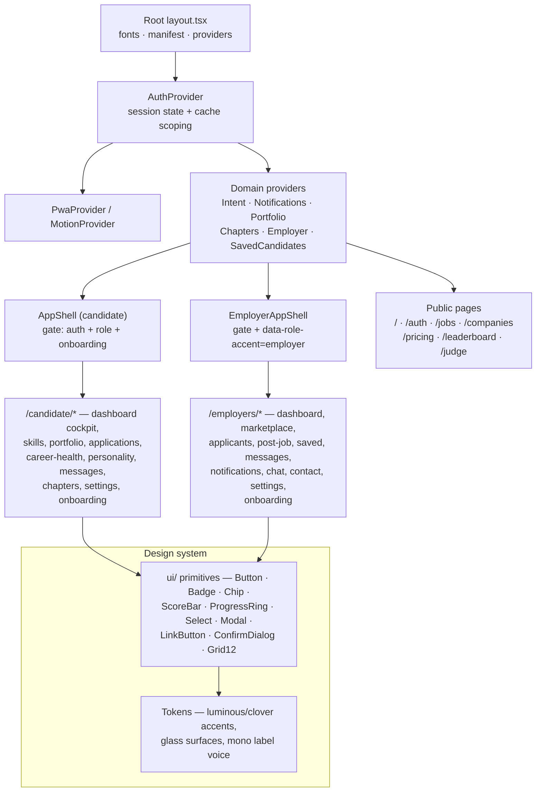

### 3.4 Design system

The design system is a first-class subsystem with its own enforcement skill (`.claude/skills/career-os-design/SKILL.md`) and canonical reference. Dark-only; two accents on one neutral chassis — **Luminous** #4D7AFF (candidate) and **Clover** #4CBB55 (employer); two type voices — Inter for display/body, **IBM Plex Mono for every small uppercase label**; glass surface scale (`glass-1..5`); a fixed radius scale; score signals animate in at a shared cubic-bezier. Role accent is structural: employer shells flip `--btn-*` variables rather than components hardcoding green. Charts (skill radar, rings, funnels) are hand-rolled SVG with accessibility baked in (aria labels, shape-encoded reference series legible without color vision). Age-adaptive density (`data-ui-density="calm"` for mid-career+, user-overridable in Settings) enlarges text and removes decorative glows without touching contrast; `html.reduce-motion` (an in-app performance toggle persisted in localStorage) disables all animation with static fallbacks. This is genuinely mature UI infrastructure for a prototype.

### 3.5 PWA layer

`src/app/manifest.ts` + icons generated at request time via `ImageResponse` (no binary assets), a minimal `public/sw.js` (app-shell cache-first, navigations network-first, `/api/*` never cached), and `PwaProvider` handling registration + a dismissible install banner. Offline support is shell-only by design — the app is online-only for data.

---

## 4. Backend Architecture Analysis

### 4.1 API conventions

Every route handler speaks one envelope, produced by `src/lib/api/respond.ts`:

```ts
{ ok: true, data: T }                            // 200
{ ok: false, error: { code, message } }          // 4xx/5xx
```

`failFromUnknown(err)` is the shared catch-all classifier:

| Thrown | Status | Code |
|---|---|---|
| `UnauthorizedError` | 401 | `unauthenticated` |
| `PaymentRequiredError` | 402 | `payment_required` (freemium gate) |
| `ForbiddenError` | 403 | `forbidden` |
| `NotFoundError` | 404 | `not_found` |
| `ConflictError` / Prisma P2002 | 409 | `conflict` |
| `ZodError` | 400 | `validation` (first issue's message) |
| Prisma P2025 | 404 | `not_found` |
| anything else | 500 | `server` — generic message in production, detail logged server-side only |

This is an excellent pattern: routes are thin `try { … } catch (err) { return failFromUnknown(err) }` wrappers; semantic errors thrown anywhere in the service layer surface with correct HTTP semantics; production responses never leak stacks, causes, or Prisma internals; expected 401/403/404s are not logged as errors (log-noise hygiene).

**Caller resolution** (`src/lib/api/currentUser.ts`): `getAuthUser()` reads the session cookie and loads the `User` row; `getCurrentCandidateProfile()` / `getCurrentEmployerProfile()` enforce the role and return the caller's own profile row (auto-creating a missing one defensively). **Every `/api/me/*` and `/api/employer/*` route is scoped through these helpers — client-supplied user ids are never trusted.** Ownership of nested resources is enforced by querying through the profile relation.

**Validation**: mutating routes parse bodies with Zod schemas (`.strict()` where shape drift matters), often with normalization (e.g. job-post skills dedupe through `normalizeSkill` so match engines see canonical names).

### 4.2 API surface by family (64 routes)

| Family | Routes | Purpose |
|---|---|---|
| `auth/*` | signup, login, logout, me, google/{start,callback,role} | First-party + optional Google SSO |
| `me/*` (candidate) | 24 routes — onboarding, intent, portfolio (+collections), skills, resume (+versions, pdf), personality, chapters, checkin, gamification, applications, conversations (+id), notifications (+id), discovery, timeline, mid-career, fair-pay, subscription, ui-density | The candidate's entire private surface |
| `employer/*` | 13 routes — me, goal, onboarding, onboarding-data, profile, jobs, applications (+id), saved, invited, notifications (+id), messages | The employer's private surface |
| Marketplace/public | marketplace (+id), candidates?, jobs (+id, apply), companies (+id), leaderboard, invites, messages/[candidateId] | Catalogue + cross-side actions |
| `account` | PATCH/DELETE | Safe field edits; password-confirmed cascade delete |
| `dev/*` | 8 routes — seed, session, state, status, reset, data, demo-login | Test harness, double-gated by `NEXT_PUBLIC_ENABLE_TEST_MODE` |

### 4.3 Service layer

`src/lib/services` holds the operations that own business invariants:

- **`applications.service.ts`** — TS-owned status union (`submitted|reviewing|interview|offer|rejected|withdrawn|expired`); `apply()` creates the Application plus its `submitted` event atomically and maps the unique-constraint violation to a friendly 409; `transition()` appends a `status_changed` event (no-op statuses write nothing); `expireOnRead()` flips stale non-terminal rows past their 30-day TTL. `responseScore(status)` converts pipeline position into the 0–100 company-responsiveness signal.
- **`jobs.service.ts`** — DB-first job listing with the curated `TARGET_JOBS` array as a defensive fallback (DB down or unseeded → the catalogue still renders); `expireStale()` sweep before listings; **fulfillment rule**: an employer's job auto-fulfills when an application on it reaches `offer` AND at least one chat message has been exchanged between the two parties — checked from both triggers (status PATCH and message POST). Soft-delete only; posts never hard-delete.
- **`gamification.service.ts`** — age-tuned cadence (`daily` below mid-career, `monthly` "Career Check-Up" for mid-career+); one deliberate check-in per period; **forgivable streaks** (one missed period bridges); XP only for real actions (10/25 per check-in); milestone badges; all three writes (streak, XP ledger, badges) in one transaction. Explicit anti-dark-pattern stance documented in the module.
- **`companies.service.ts` / `leaderboard.service.ts`** — company responsiveness aggregation from real application statuses (zero-applicant companies get a deterministic seeded score labelled "Demo data"); curated, cited university leaderboard (never ranks real users).
- **`candidates/projection.ts`** — the marketplace mirror (Section 8.3), deliberately never throwing into its caller.

### 4.4 Authentication layer

*Figure 6 — Authentication flow.*

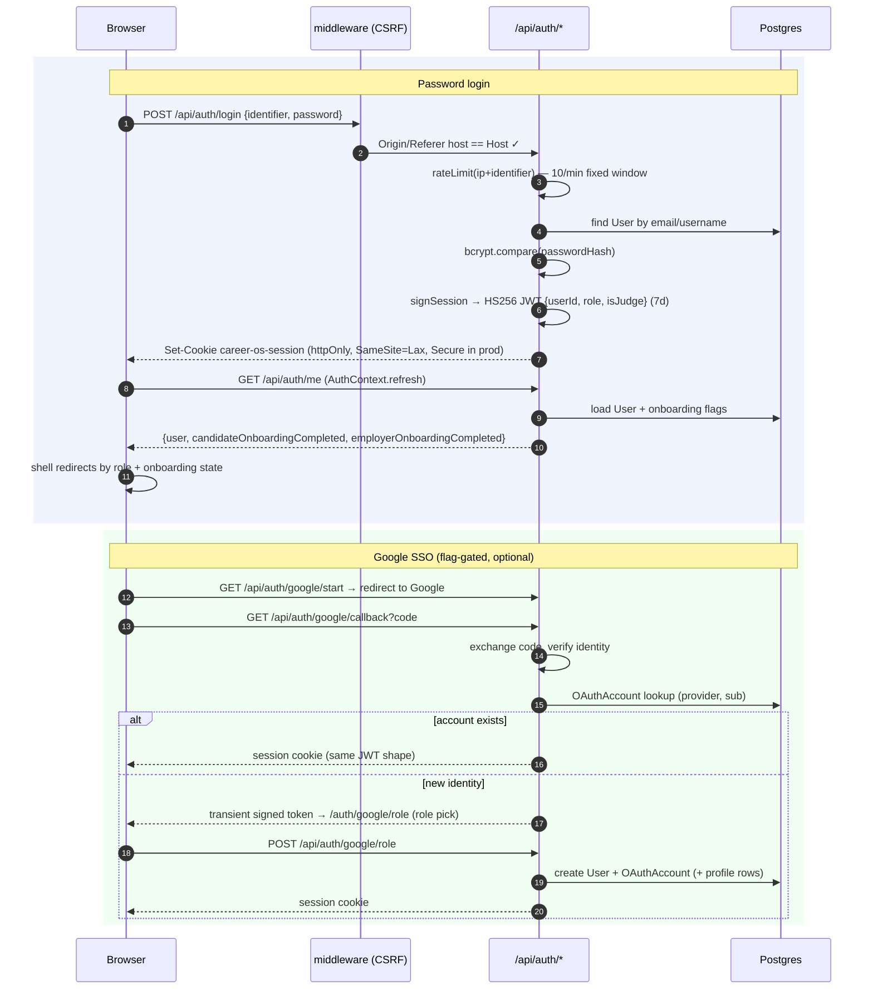

Strengths: the signing key is resolved lazily and **fails closed in production** (a missing `AUTH_SECRET` throws rather than falling back); the dev fallback is loud and clearly marked; SSO reuses the exact same session shape (one session system, not two); the OAuth handshake state travels in short-lived signed transient tokens that can never be replayed as sessions (different payload shape). Password hashing is bcrypt. CSRF is handled by Origin/Referer host validation on all mutating `/api/*` requests, which pairs correctly with `SameSite=Lax` cookies.

Known limitations (Sections 12/15): the JWT is stateless with no revocation list (logout clears the cookie but a stolen token stays valid up to 7 days); no email verification, password reset, or 2FA; the rate limiter is per-instance in-memory (documented as best-effort — serverless deploys reset it per lambda).

### 4.5 Permissions model

Authorization is role + ownership + entitlement, enforced in three layers:

1. **Role**: `getCurrentCandidateProfile` / `getCurrentEmployerProfile` throw `ForbiddenError` for the wrong role (JWT role is advisory; the DB row is re-checked per request).
2. **Ownership**: all queries go through the caller's own profile id resolved from the session; nested resources (portfolio items, chapters, resume versions, applications) are fetched via the owning relation, so cross-tenant access is structurally impossible rather than filter-dependent.
3. **Entitlement** (`src/lib/billing/entitlements.ts`): plan-grained freemium — `resolveIsPro()` re-reads `isJudgeAccount || subscription.plan === "pro"` fresh from the DB each request (never trusted from the JWT); `requireEntitlement()` throws the 402; `checkEntitlement`-style redaction trims Pro fields (fair-pay benchmark, skill-bridge detail) from free responses instead of blocking the whole route. Exactly three Pro gates exist (resume PDF, fair-pay report, skill-bridge detail); the headline Career Health Score is deliberately always free.

There is no admin role — administrative affordances exist only as the flag-gated dev harness, which re-checks its flag in every `/api/dev/*` route and operates solely on the seeded test account resolved server-side by username.

### 4.6 Request lifecycle

*Figure 7 — API request lifecycle.*

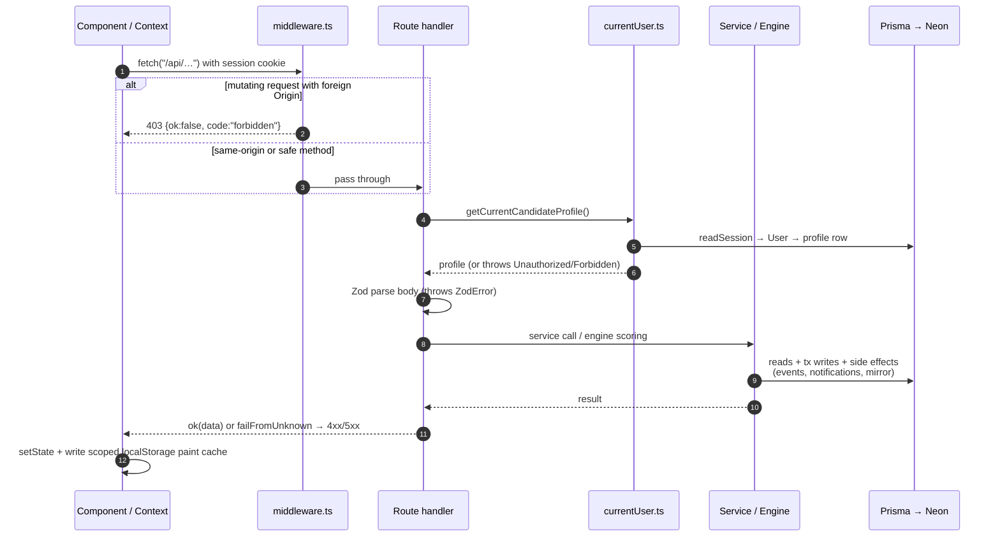

---

## 5. Database Analysis

### 5.1 Model inventory (32 models)

| Group | Models | Notes |
|---|---|---|
| Identity | `User`, `OAuthAccount`, `Subscription` | One User per account, role `CANDIDATE\|EMPLOYER`; `passwordHash` optional (SSO-only accounts); `isJudgeAccount` bypass flag |
| Candidate profile | `CandidateProfile`, `CandidatesAI`, `MidCareerProfile`, `PersonalityResult` | Profile = the living CV; CandidatesAI = 5-step guided onboarding answers powering personalization; MidCareer adds `problemsSolved` + **private** salary; Personality = deterministic archetype (descriptive only) |
| Evidence | `SkillClaim`, `Certificate`, `Award`, `Project`, `Experience`, `ResumeVersion`, `ChapterEvent` | SkillClaim carries the 3-tier trust system (`@@unique(profileId, name)`); ResumeVersion stores full JSON snapshots so old versions stay reproducible |
| Gamification | `XpLedger`, `Streak`, `Badge` | Ledger (append-only), one streak per profile, `@@unique(profileId, key)` badges |
| Employer | `EmployerProfile`, `EmployersAI`, `EmployerSavedCandidate`, `EmployerInvitedCandidate`, `EmployerNotification` | Saved/Invited are composite-key join tables |
| Marketplace | `Candidate` | The catalogue employers browse: seeded demo rows **and** projected real users (`id = real-<userId>`, `source="real"`, `visible` mirrors the candidate's opt-in) |
| Jobs | `Company`, `Job`, `Application`, `ApplicationEvent` | Jobs: CSV-seeded catalogue + employer-posted rows (owner, status lifecycle, weighted `skillWeights`, budget/timeline); Application unique per (candidate, job) with append-only event log |
| Messaging | `ChatConversation`, `ChatMessage` | Unique per (employer, candidate-mirror); sender is `"employer"\|"candidate"` |
| Notifications | `CandidateNotification`, `EmployerNotification` | Independent per side; kind/severity as string unions |
| Reference data | `SalaryBenchmark`, `University` | Curated, cited, `isDemo`-labelled; natural unique keys keep seeds idempotent |

### 5.2 Conventions and their trade-offs

- **cuid() primary keys** everywhere (except natural-slug seed ids on `Job`/`Candidate`) — opaque, collision-resistant, URL-safe. The schema explicitly forbids a native-UUID migration as a destructive rewrite; correct call.
- **String pseudo-enums.** Statuses, kinds, tiers-adjacent values are `String` columns whose legal values live in TS unions + Zod. Trade-off: no DB-level integrity (a buggy writer could store an illegal value), but zero-migration evolution of value sets. Given single-writer discipline through the service layer, this is a reasonable prototype choice; the checks in Section 12 recommend CHECK constraints only if non-TS writers ever appear.
- **Cascade deletes** flow from `User` down through every owned row — account deletion (`DELETE /api/account`) is real and complete.
- **Indexes** exist on every FK plus query-shaped composites (`[employerId, createdAt]` on notifications, `[profileId, createdAt]` on candidate notifications, category/matchScore/visible/source on the catalogue). No obvious missing index for current query patterns; `Application` could use `[candidateProfileId, createdAt]` if the timeline list grows.
- **JSON columns** are used for genuinely schema-less payloads (skill levels map, timeline display metadata, resume snapshots, personality answers, job skill weights) — appropriate, all owner-scoped.
- **In-schema documentation** is exceptional: nearly every model carries a design-note comment explaining intent and ownership of legal values. This is the best-documented Prisma schema most reviewers will see.

### 5.3 The dual-candidate design (the schema's key idea)

The `Candidate` catalogue and real users are deliberately separate, then bridged:

- Seeded demo rows (`source="seed"`, `isDemo`) keep the employer marketplace populated and demo-safe regardless of real signups.
- A real candidate who flips **discovery** on is *projected* into the same table by `syncMarketplaceMirror(userId)`: id `real-<userId>`, `source="real"`, `userId` FK back to the account, `visible` mirroring `CandidateProfile.discoverable`. The projection derives category/stage/availability/growth-signal heuristically, computes readiness through the shared rubric, mirrors the personality archetype as a descriptive tag, and writes an honest "signals are self-reported" recommendation blurb.
- Because every employer flow (list, save, invite, chat) was already keyed on `Candidate`, real people join the marketplace **with zero changes to employer code**, and the `userId` link lets the candidate's inbox resolve employer conversations from the mirror.

Turning discovery off hides the row (`visible=false`) but preserves saves/invites/conversations — a thoughtful referential-integrity decision. The projection never throws into its caller (a mirror failure must not break a profile write); the cost is that mirror consistency is eventual-by-write-path rather than guaranteed (no reconciliation sweep exists — noted in Section 17).

### 5.4 The append-only event spine

`Application` (current status) + `ApplicationEvent` (immutable history: `submitted` / `status_changed` / `expired`, with from/to statuses) is the closest thing to an event log in the system. It powers the candidate's per-application timeline, the employer pipeline, company responsiveness metrics, and job fulfillment. Both TTL mechanics (application 30-day expiry, job-post 30-day expiry) are enforced expire-on-read rather than by a scheduler — correct results with lazy timing, at the cost of stale rows lingering until someone looks (and of writes occurring during GET requests).

### 5.5 Entity-relationship overview

*Figure 8a — Database relationships: identity & candidate space. For legibility, sibling child tables are collapsed into group boxes — each named row inside a group is its own physical table, FK'd to the parent shown (full inventory in §5.1).*

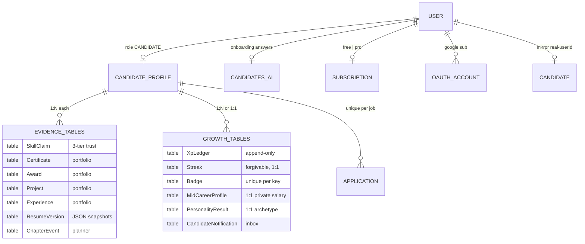

*Figure 8b — Database relationships: employer side, marketplace, jobs & messaging.*

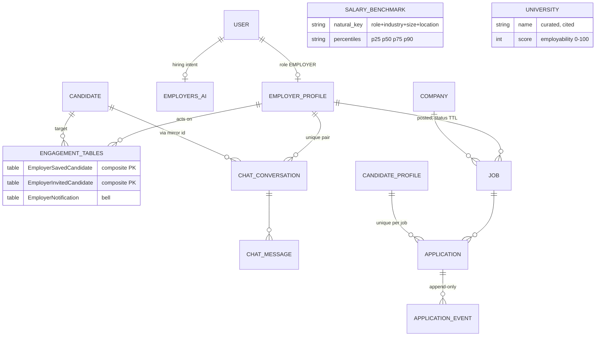

### 5.6 Integrity assessment

Referential integrity is strong (FKs + cascades everywhere; composite PKs on join tables; `@@unique` guards on one-per-user rows, per-profile skill names, per-pair conversations, per-(candidate,job) applications). The deliberate soft spots are the string pseudo-enums (TS-owned) and two heuristic bridges that trade precision for simplicity, both documented in-code: employer notification targeting by **organization-name match** to the job's company (no owner on catalogue jobs), and job fulfillment's "message between the two parties" standing in for job-scoped threads. Both are flagged in the debt register (Section 17).

---

## 6. Candidate Journey Analysis

The requested ideal journey (Landing → Sign Up → Onboarding → Assessment → Growth Plan → Dashboard → Learning → Portfolio → Skill Verification → Matching → Job Discovery → Application → Interview → Feedback → Continuous Growth) maps onto CareerOS as follows. Stages marked ◐ are partially implemented; ✗ marks stages that exist only as data points, not workflows.

| Ideal stage | CareerOS reality | Status |
|---|---|---|
| Landing | Marketing homepage (`/`), pricing, public jobs/companies/leaderboard | ✓ |
| Sign up | `/auth` — password or Google SSO; role selection; rate-limited | ✓ |
| Onboarding | 5-step guided flow (stage, discovery, growth, progression, feedback) + CV import (PDF/DOCX parsed client-side, deterministic heuristics) → `CandidatesAI` | ✓ |
| Assessment | No formal assessment; the analogues are the personality quiz (descriptive archetype) and the self-reported skill levels from onboarding | ◐ |
| Growth plan | Cockpit dashboard's "How do I get there" + skill-gap analysis + ONE recommended next step from the Skills Truth engine; career-health suite for mid-career+ | ◐ |
| Dashboard | Four-question cockpit, phase-aware (student → executive), age-adaptive density | ✓ |
| Learning | Curated per-skill improvement suggestions (`src/lib/skills/learning.ts`) surfaced in the skill bookshelf — a static map, not a learning-management system; no progress records | ◐ |
| Portfolio | Living Portfolio: experiences/projects/certificates/awards, completeness checklist, named resume versions, PDF export (Pro) | ✓ |
| Skill verification | 3-tier trust: self-claimed ×0.5 → evidence-backed ×0.8 → endorsed ×1.0; tier derived server-side from evidence/endorsement fields, never client-set | ✓ (self-attested evidence — no third-party verification) |
| Matching | Per-caller job match via skill-bridge coverage; marketplace visibility via opt-in discovery projection | ✓ |
| Job discovery | `/jobs` catalogue (seeded + employer-posted), search/filter by field/location, personalized re-ranking | ✓ |
| Application | One-click apply → `Application` + event log; employer notified; 30-day auto-expiry | ✓ |
| Interview | A pipeline **status** only (`interview`) — no scheduling, no interview artifacts | ✗ |
| Feedback | Status transitions render as a timeline with stage explanations; no structured employer feedback | ◐ |
| Continuous growth | Check-in loop (daily / monthly Career Check-Up by phase), forgivable streaks, XP for real actions, badges; profile edits re-project the marketplace mirror | ✓ |

*Figure 1 — Candidate process flow (DB = database write, N = notification created).*

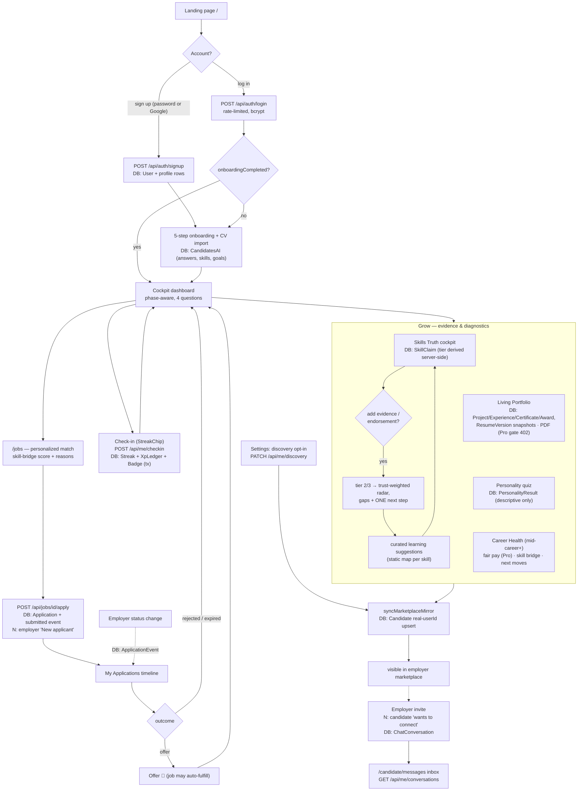

**The invisible system layer under each candidate action:**

| Candidate action | Synchronous system effects |
|---|---|
| Completes/edits onboarding | `CandidatesAI` upsert → `onboardingCompleted` flips → shells re-route; personalization summary regenerates; mirror re-projects if discoverable |
| Edits portfolio/skills/profile | Owning rows written → `CandidateProfile.skills` mirror of claim names maintained → readiness recomputed on next projection → `syncMarketplaceMirror` refreshes the employer-facing row (never throws into the save) |
| Adds evidence/endorsement to a skill | Tier re-derived server-side in `/api/me/skills` → trust-weighted radar/score shift → marketplace mirror picks up new top skills |
| Applies to a job | `Application` + `submitted` event (atomic); org-name-matched employers get an `EmployerNotification`; company responsiveness metrics gain a data point |
| Opens applications list | `expireOnRead` flips stale rows to `expired` (writes an event) — reads can mutate |
| Checks in | One transaction: streak upsert (forgivable bridge), XP ledger append, milestone badges; cadence re-tuned to current phase |
| Toggles discovery | Mirror row created/updated or hidden (`visible=false`) — saves/invites/conversations preserved |

There is **no** background recalculation, no visibility-score refresh, no analytics pipeline, and no notification fan-out beyond the specific rows described — every effect above happens inside the originating HTTP request.

---

## 7. Employer Journey Analysis

| Ideal stage | CareerOS reality | Status |
|---|---|---|
| Landing / registration | Same `/auth` flow, role EMPLOYER | ✓ |
| Company setup | 5-step onboarding → `EmployersAI` (company context, hiring goal, role direction, candidate signals, matching prefs) + narrative summaries; org name on `EmployerProfile` | ✓ |
| Employer dashboard | `/employers/dashboard` — hiring snapshot, pipeline shortcuts | ✓ |
| Create talent need | Two forms: onboarding preferences (drive marketplace personalization) and **job posting** (`/employers/post-job` — 3–5 weighted skills, requirements, budget/timeline; lands in the public candidate feed immediately) | ✓ |
| AI candidate matching | `explainMatch` — deterministic weighted scoring (role 35 / skills 30 / industry 15 / green flags 10 / baseline 10) with per-reason weights printed and an explicit uncertainty note | ✓ (deterministic, not ML) |
| Review profiles | Marketplace rows (match-first), candidate detail modal with insight engine + readiness factor breakdown + Bias-Check note on the archetype tag | ✓ |
| Invite candidate | Transactional invite: invited-row upsert + employer notification + conversation with the intro message; real candidates also get an inbox notification | ✓ |
| Interview | Status transition only | ✗ |
| Hire | `offer` status + fulfillment rule (offer + message exchanged → job auto-fulfills, leaves the public feed) | ◐ |
| Market intelligence | Salary benchmarks (curated CSV), company responsiveness scores, marketplace composition — no trend reports or demand analytics | ◐ |
| Pipeline management | `/employers/applicants` — per-application status PATCH with append-only history | ✓ |
| Continuous hiring | Saved candidates, invited list, refreshed marketplace on preference edits (`?edit=1` re-entry), job-post lifecycle | ✓ |

*Figure 2 — Employer process flow.*

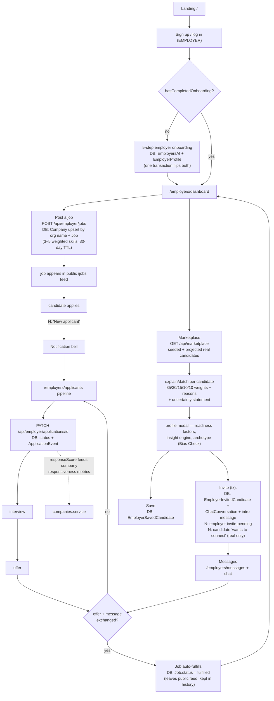

**The invisible system layer under employer actions:**

| Employer action | Synchronous system effects |
|---|---|
| Completes onboarding | `EmployersAI` + `hasCompletedOnboarding` flip in one transaction; marketplace personalization summary computes from the stored intent |
| Opens marketplace | Live re-scoring of every visible catalogue row against the employer's stored prefs (no precomputed index — Section 8.4); demo fallback only under test mode |
| Posts a job | Company upsert by organization name; skills normalized to canonical taxonomy names so candidate-side engines match; 30-day `expiresAt` |
| Changes application status | Event appended; company responsiveness updates on next read; `maybeFulfillJobs` checks the offer+message rule |
| Sends a message | `ChatMessage` insert; `maybeFulfillJobs` re-check (chat is the second fulfillment trigger); optional simulated reply only when `NEXT_PUBLIC_ENABLE_DEMO_CHAT` |
| Marks notifications read | `EmployerNotification.read` only — never touches messages (the two systems are deliberately independent) |

---

## 8. System Design Analysis

### 8.1 Module map

*Figure 4 — Backend module map.*

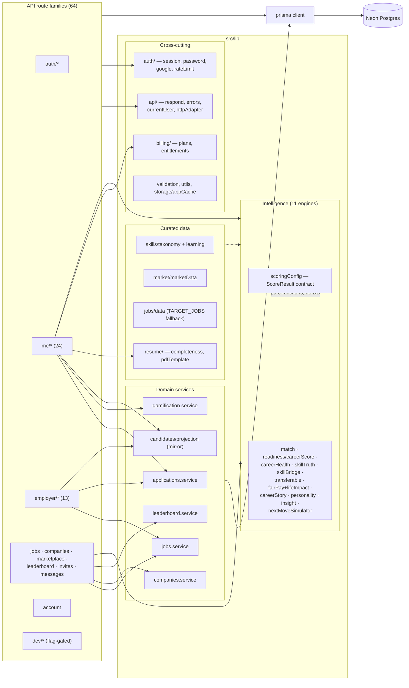

The dependency direction is clean and acyclic: routes → services/engines → prisma. Engines are **pure** (no I/O) — routes assemble their inputs from Prisma and pass plain objects in, which is what makes the CI check harness possible. No circular dependencies were found in the import graph spot-checks; contexts depend on `lib/api` types but never the reverse.

### 8.2 An end-to-end information flow (worked example)

*A candidate adds endorsement evidence to a skill:*

1. Skills page PATCHes `/api/me/skills`; Zod validates; `getCurrentCandidateProfile()` scopes the write.
2. The route **derives** the tier from the evidence/endorsement fields (tier is never accepted from the client), updates `SkillClaim`, and maintains `CandidateProfile.skills` as the mirror of claim names — the compatibility view every older engine and the marketplace read.
3. `scoreSkillTruth` recomputes the trust-weighted score, radar axes, gaps, and the single recommended next step; the response carries the full explanation.
4. `syncMarketplaceMirror` re-projects the candidate: new top skills, recomputed readiness — the employer marketplace reflects the change on its next query (no index refresh step exists; scoring is at read time).
5. The client updates context state and its scoped localStorage paint cache.

Steps 1–4 are one HTTP request; nothing else in the system learns about the change until it reads the database.

### 8.3 Search, ranking, and "indexing"

There is no search infrastructure. "Search" is Prisma `contains` filters (jobs by title/company, marketplace by category/filters) over indexed columns; ranking is **computed at read time** — the jobs list runs `scoreSkillBridge` per row per request, the marketplace runs `explainMatch` per visible candidate per request. At catalogue scale (tens of rows) this is free and always fresh; at real scale it becomes the primary hot spot (Section 15/18: pagination first, then precomputed or cached scores, then a real index).

### 8.4 Requested subsystems vs. reality

The analysis brief names an idealized component set. The honest mapping:

| Requested component | CareerOS implementation | Status |
|---|---|---|
| Matching Engine | `explainMatch` + `scoreSkillBridge` + `candidateMatchEngine` — deterministic, explainable | ✓ |
| Skills Graph | Flat canonical taxonomy + normalizer (`skills/taxonomy.ts`); no relationships between skills | ◐ |
| Candidate / Employer Index | Postgres B-tree indexes + read-time scoring; no search index | ◐ |
| Growth Engine | Gamification service + skill-gap "one next step" + phase-aware cockpit | ◐ |
| Gap Analysis Engine | `skillTruthEngine` (radar gaps) + `skillBridgeEngine` (per-job missing skills) | ✓ |
| Intelligence Engine | The 11-engine layer (Section 9) | ✓ |
| Recommendation Engine | `nextMoveSimulator` (career pathways), job re-ranking, next-step suggestions | ✓ |
| Notification Service | Notification **rows** written inline + fetch-on-navigation bells; no dispatch/delivery service, no email/push | ◐ |
| Learning Engine / Records | Curated static suggestions per skill; no records, progress, or providers | ✗ (embryonic) |
| Analytics Engine | None (no product analytics, no warehouse) | ✗ |
| Event Bus | None — synchronous side effects + the append-only `ApplicationEvent` log | ✗ |
| Vector Search | None — and deliberately: matching is explainable arithmetic, not embeddings | ✗ (by design, for now) |

This table is the single most important calibration for readers of this document: CareerOS's architecture *language* (engines, scores, signals) sounds like a large distributed system, but the implementation is a well-factored monolith where "engines" are pure functions and "events" are rows. That is the right shape for the current stage — the risk is only in forgetting which parts are real when planning.

---

## 9. Career Intelligence Engine Analysis

### 9.1 The contract

Every engine returns the shared shape defined in `src/lib/intelligence/scoringConfig.ts`:

```ts
interface ScoreResult {
  score: number;          // 0–100, clamped
  reasons: string[];      // human-readable, strongest first, weights named
  factors?: ScoreFactor[];// per-factor earned/max breakdown
  uncertainty?: string;   // what the score does NOT know
}
```

plus shared helpers (`clampScore`, `tokensOverlap`, `fromFactors`, standard uncertainty copy) and the `ARCHETYPES` definitions. Engines are pure and deterministic: same inputs → same outputs, no I/O, no randomness, no LLM. `npm run check:intelligence` runs assertion suites over all of them in CI on every push — including behavioral invariants like *an endorsed expert must outrank an identical self-claim* (the anti-gaming property of the trust system).

### 9.2 Engine inventory

| Engine | Input | Output (beyond ScoreResult) | Consumers |
|---|---|---|---|
| `skillTruthEngine` (flagship) | SkillClaims (level + tier) + target-role requirements | trust-weighted radar axes, gap list, ONE next step, `marketValue` | Skills cockpit, dashboard, mirror projection |
| `careerScoreEngine` / `readiness` | visible profile signals | factor breakdown (basics 15 / skills 30 / portfolio 30 / growth 15 / availability 10) | Marketplace rows, projection, insight modal |
| `candidateMatchEngine` → `explainMatch` | Candidate row + `EmployersAI` prefs | weighted reasons (35/30/15/10/10) + uncertainty | Marketplace ranking, detail modal, employer summary |
| `skillBridgeEngine` | job requiredSkills + candidate skills | matched/missing per job, coverage score | Jobs feed match badge, career-health top jobs (Pro detail gate) |
| `careerHealthEngine` | tenure, growth, skills, market signals | pillar factors | Career Health home (mid-career+) |
| `fairPayEngine` | private salary + `SalaryBenchmark` percentiles | band (below/fair/above), `pickBenchmark` fallback chain, `scoreLifeImpact` | Fair Pay calculator (Pro), mid-career API |
| `transferableSkillEngine` | current skills + target field | transferable subset + narrative | Career health, pivot views |
| `careerStoryEngine` | experiences | story arc analysis | Portfolio/resume narrative |
| `personalityEngine` | quiz answers | archetype + per-archetype points ("the why") | Personality page; archetype mirrors to marketplace as a **descriptive** tag only |
| `employerCandidateInsightEngine` | Candidate row | strengths/risks summary | Employer detail modal |
| `nextMoveSimulator` | profile + pathway jobs | ranked `Pathway[]` with reasoning | Next Move Navigator |

*Figure 10 — Intelligence engine dataflow.*

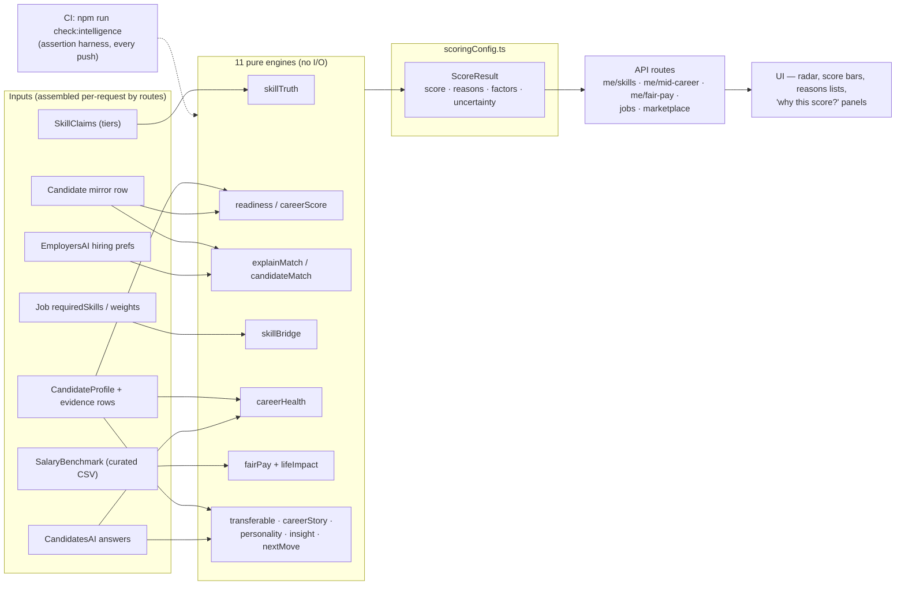

### 9.3 Inputs available vs. the aspirational model

Of the brief's ideal input set — candidate skills ✓, employer demand ✓ (stored prefs + posted-job skills), learning completion ✗ (no records), engagement ◐ (streak/XP exist but never feed scores), applications ✓, interviews ◐ (status only), hiring outcomes ◐ (offer + fulfillment, unused as a learning signal), external market trends ✗ (static curated benchmarks stand in), salary benchmarks ✓ (curated, cited, demo-labelled).

The significant architectural fact: **the intelligence layer does not learn.** Weights are hand-set constants; outcomes never feed back into scoring. That is a deliberate, defensible stage-appropriate choice (explainability, zero bias-training risk, demo determinism) — but it means "the platform's intelligence continuously improves through user activity" is today true only in the sense that *data* accumulates, not that *models* improve. Section 18 sketches the upgrade path that preserves explainability.

### 9.4 Requested scores without direct equivalents

- **Candidate Visibility Score** — closest: readiness (drives marketplace baseline) + resume completeness. No dedicated visibility metric or "profile views" analytics.
- **Career Capital Score** — closest: career health score + `marketValue` from skill truth. No unified longitudinal capital metric.

Both would be natural, cheap additions on top of the existing factor pattern.

### 9.5 Matching engine detail

*Figure 9 — Matching flows on both sides.*

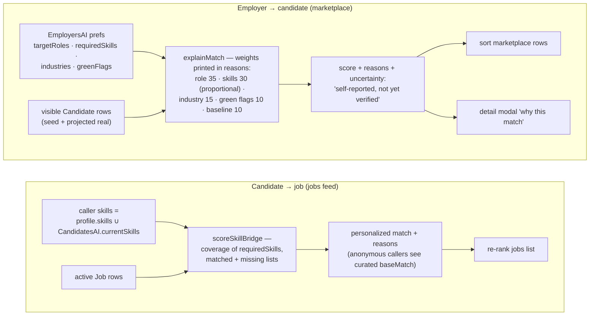

Fairness properties worth stating: the personality archetype is **excluded from every score** (enforced by convention + a Bias Check note on employer surfaces); scores clamp to 0–100; every surface that shows a number can show its reasons; and the uncertainty string explicitly tells employers the signals are self-reported. The main fairness gap is inherent to token matching: skill-name normalization exists, but a candidate who phrases skills unusually under-scores — a semantic-matching upgrade (Section 18) should be paired with an explanation-preserving design.

---

## 10. Event-Driven Architecture Analysis

### 10.1 The honest headline

**CareerOS has no event-driven architecture.** There is no bus, no queue, no pub/sub, no webhooks, no scheduler. What it has instead — and it is a coherent pattern, consistently applied — is:

1. **Synchronous request-scoped side effects**: the route that handles an action also performs its consequences (write notification rows, sync the mirror, check fulfillment) before responding.
2. **One append-only domain log**: `ApplicationEvent`, the auditable history that both sides' timelines render.
3. **Expire-on-read**: time-driven transitions happen lazily when data is next queried, instead of via cron.
4. **Poll-on-navigation delivery**: bells and inboxes fetch on mount/route-change (no `setInterval` polling loops, no sockets) — a deliberate zero-infrastructure choice; freshness is bounded by user navigation.

### 10.2 Actual event catalogue (trigger → effects)

| Domain event | Trigger | Synchronous effects |
|---|---|---|
| ProfileUpdated | any profile/portfolio/skills/onboarding PATCH | mirror re-projection (readiness, top skills, growth signal recomputed); completeness changes on next read |
| SkillVerified (tier up) | evidence/endorsement added | tier derived server-side → trust-weighted scores shift → mirror refresh |
| DiscoveryToggled | settings PATCH | mirror shown/hidden (`visible`), relations preserved |
| CandidateApplied | apply POST | Application + `submitted` event (atomic); `EmployerNotification` to org-name-matched employers |
| ApplicationStatusChanged | employer PATCH | `status_changed` event append; responsiveness signal updates; `maybeFulfillJobs` (offer path) |
| ApplicationExpired | next read past TTL | `expired` event; status flip |
| InviteSent | invites POST | transaction: invited row + employer notification + conversation w/ intro message; cross-side `CandidateNotification` for real candidates |
| MessageSent | messages POST | `ChatMessage` insert; `maybeFulfillJobs` re-check; flag-gated simulated reply (demo only) |
| JobCreated | employer jobs POST | Company upsert; job enters public feed immediately |
| JobExpired / JobFulfilled | read sweep / offer+message rule | status flip; leaves public feed, stays in employer history |
| CheckInCompleted | checkin POST | transaction: streak (forgivable), XP ledger, milestone badges |
| AccountDeleted | account DELETE | password re-check; cascade delete of every owned row; session cleared |

Events from the brief with **no implementation**: `EmployerSavedSearch` (no saved searches — only saved candidates), `InterviewCompleted` (status only), `LearningCompleted`, `CertificationEarned` (certificates are rows, not events — adding one is just a portfolio edit). `HiringCompleted` exists only as the offer/fulfillment approximation.

*Figure 11 — Effect flow as implemented (all synchronous).*

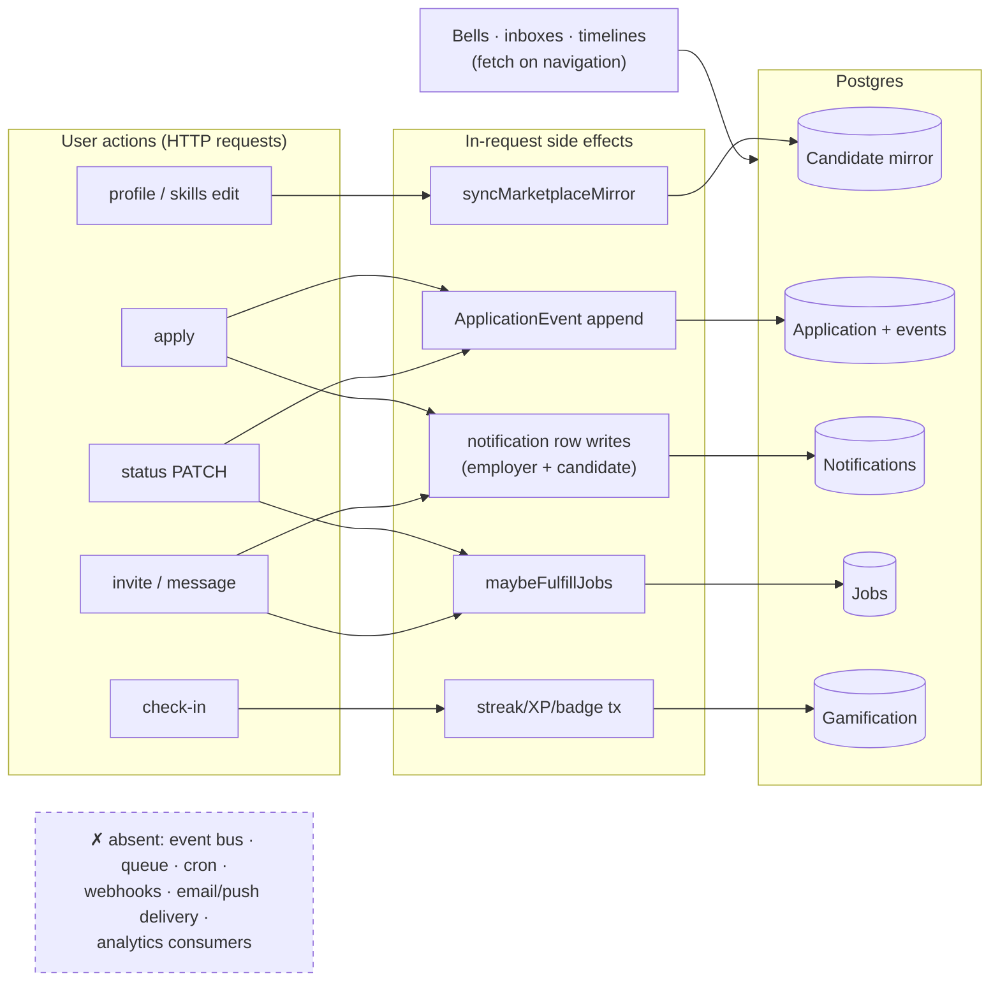

### 10.3 Consequences of the synchronous design

**Wins:** zero infrastructure, transactional consistency where it matters (invite, check-in, apply are atomic), trivially debuggable (one stack trace per action), no delivery-ordering problems.

**Costs:** side-effect latency rides on user requests (mirror projection adds queries to every profile save); failure coupling is managed ad hoc (the mirror swallows errors; notification writes after `apply` do not — a failed notification write fails the whole apply even though the application was created); effects are invisible to any future consumer (no outbox to subscribe to); and anything time-based only happens when someone looks. The extraction path — an outbox table written in the same transaction as the domain change, drained by a worker — is the single highest-leverage architectural upgrade available and is detailed in Section 18.

### 10.4 Notification subsystem

*Figure 12 — Notification flow.*

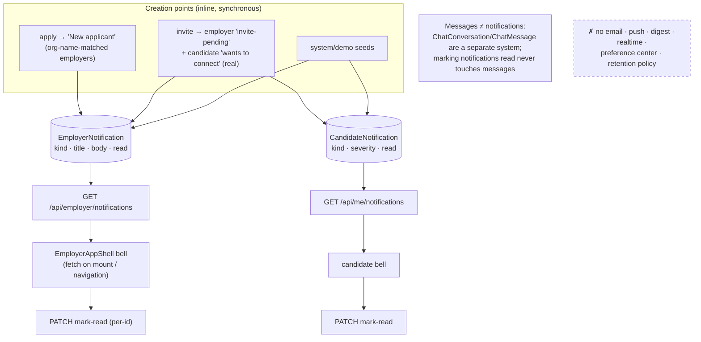

The messages/notifications separation is clean and correct. The gaps are delivery (nothing reaches a user who isn't in the app — despite the PWA groundwork that could host web push), lifecycle (no retention/archival), and preferences (no per-kind mute).

---

## 11. UX Design Review

Assessed from a product-design perspective across all 35 screens (this review follows a full-application design pass, so observations are grounded in every page, not a sample).

**Navigation.** The two-shell model is coherent: candidates get a persistent desktop sidebar + a mobile TopMenu whose nav groups are mobile-only (Settings/account persist everywhere); employers mirror it in clover. Cross-side redirects are automatic and role-correct. The four-question cockpit is a genuinely strong IA move — every card deep-links into the owning module, so the dashboard is a router, not a dumping ground. Minor friction: some destinations are reachable only through the cockpit or TopMenu but not the sidebar, and breadcrumbs are absent on deep pages (job detail → back relies on browser history).

**Information hierarchy & visual language.** Excellent and unusually consistent: mono uppercase eyebrows label every zone; display type is reserved for greetings/scores; accent color = ownership (luminous candidate / clover employer) rather than decoration; score signals always pair number + bar/ring + reasons. Employer marketplace rows lead with the match box (the decision-driving number) followed by identity, evidence chips, then actions — correct scan order.

**Onboarding.** The 5-step guided flow with CV import is well-paced conceptually (stage → discovery → growth → progression → feedback), supports `?edit=1` re-entry from Settings (answers editable without restarting — a detail most prototypes miss), and choice cards use explicit radio affordances. Frictions: the flow is long for younger phases (many optional fields presented with equal weight); CV import quality depends on deterministic heuristics, and partially-parsed fields are marked "from your CV" but there's no confidence signal; there is no save-and-resume indicator mid-flow (state survives, but the user isn't told).

**Dashboards.** Phase-awareness is real: younger phases get vibrant density and daily streaks; mid-career+ gets calm density (larger type, no decorative glows), a quiet monthly check-up, and the Career Health suite as the "how do I get there" answer. The age-adaptive density is user-overridable — adaptation without lock-in, the right pattern.

**States.** Empty states exist and are designed (messages placeholder, applications empty, skills bookshelf prompt, notification empties); loading is mostly skeleton/`Loading…` cards (visible flashes on cold compiles; some pages fetch sequentially and could parallelize); error handling has a global `error.tsx` + `not-found.tsx`, and API failures surface as inline messages rather than toasts everywhere — acceptable but inconsistent between pages. Freemium gates use a shared `UpgradeModal` with honest copy (mock billing is labelled).

**Accessibility.** Above-prototype average: semantic controls (`role="switch"`, `aria-pressed` chips, `role="alert"` errors, labelled inputs), the skill radar has an aria description and a shape-encoded (dashed) reference series legible without color vision, native `<details>`/`<select>` are used where possible, animations respect an in-app reduce-motion toggle mapped to `html.reduce-motion`, and calm density raises readability. Gaps: no skip-to-content link, focus management on route change is default, modal focus-trap behavior should be verified, and a contrast audit for muted-on-glass text at small sizes is warranted. No automated a11y checks run in CI.

**Responsiveness.** The zero-scroll shell holds on desktop; mobile gets the TopMenu structure and a `docs/mobile-pass.md` exists documenting a dedicated pass. Wide tables (applicants pipeline) scroll within their region.

**Top UX improvements (ordered):** (1) notification delivery — an in-app-only bell that updates on navigation reads as "nothing happens here"; even a lightweight poll/badge count changes perceived liveness. (2) Onboarding progressive disclosure — defer optional preference fields to a post-onboarding "complete your profile" loop. (3) Consistent async feedback — one toast/inline pattern for save states across pages. (4) Candidate messaging depth — the inbox lists conversations; replying flows should match the employer side's completeness. (5) Add skip-nav + focus-on-heading after route change. (6) Explain scores at first touch — first-run tooltips on match/readiness leverage the reasons the engines already produce.

---

## 12. Code Quality Audit

**Method.** Full read of the backend core (schema, auth, api, services, engines, key routes), structural sweep of all 64 routes and 35 pages, import-graph spot checks, dead-code search, and lint/typecheck/build/check-suite runs (all green at time of writing).

### 12.1 What is excellent

| Area | Evidence |
|---|---|
| Error architecture | Semantic error classes + one classifier → correct HTTP semantics everywhere; production leak-proofing; log-noise hygiene (`respond.ts`) |
| Auth discipline | Fail-closed secret resolution; DB-re-checked role/entitlements per request; transient tokens distinct from sessions; scoped cache purge on account switch |
| Intelligence layer | Pure, deterministic, one shared contract, behavioral invariants asserted in CI (`__checks__/engines.check.ts`) |
| Schema literacy | Every model documents intent, ownership of legal values, and privacy notes (`salaryPrivate` "never projected") in-schema |
| Debt honesty | Deliberate shortcuts carry `ponytail:` markers naming the ceiling and upgrade path — a self-maintaining debt ledger |
| Type discipline | Strict TS, no `any` (convention + lint), `unknown`+guards at boundaries, TS unions as single source of truth for enums |
| Naming | Consistent: `*.service.ts`, `*Engine.ts`, route families, PascalCase components, kebab routes, scoped cache keys |

### 12.2 Findings register

Severity: how much damage if unaddressed. Priority: when to act.

| # | Finding | Category | Severity | Priority | Recommended solution |
|---|---|---|---|---|---|
| Q-01 | No automated tests beyond 8 check scripts — auth flows, route authz, services, and UI have zero regression coverage | Testing | **High** | **Now** | Vitest for services/routes (the pure-engine pattern already proves testability); Playwright smoke for the 5 core journeys; wire into CI |
| Q-02 | Stateless JWT with no revocation — logout doesn't invalidate stolen tokens for up to 7 days; account deletion leaves live tokens | Security | Medium | Now | Add a `sessionVersion` on User checked in `getAuthUser` (cheap), or short-lived access + refresh rotation later |
| Q-03 | Rate limiter is per-instance in-memory — near-zero effect on serverless (per-lambda state) | Security | Medium | Now | Upstash/Redis fixed-window (drop-in at the same call sites); keep the in-memory fallback for dev |
| Q-04 | Client-only page gating — protected shells flash and are downloadable pre-auth (data itself is server-guarded) | Security/UX | Low–Med | Next | Session-cookie presence check in `middleware.ts` for `/candidate/*`, `/employers/*` as defense-in-depth |
| Q-05 | `candidate/onboarding/page.tsx` at 1,521 lines (state machine + 5 steps + CV import in one file); `employers/onboarding` 863; `usePortfolio` 630 | Maintainability | Medium | Next | Extract per-step components + a `useOnboardingMachine` hook; target <400 lines/file |
| Q-06 | Dead code: `src/components/employer-onboarding/steps/*` (5 files, zero importers — the live flow is inline in the page) | Dead code | Low | Now (trivial) | Delete; also remove the vestigial `/candidate/resume` page if the redirect is no longer linked |
| Q-07 | Data-access inconsistency: typed `httpAdapter` covers ~11 operations; everything newer uses raw `fetch` + ad-hoc envelope types (incl. `AuthContext`) | Consistency | Medium | Next | Either finish the adapter (one generated client from route types) or delete it and standardize on a tiny `apiFetch<T>()` — half-adopted abstractions cost more than none |
| Q-08 | Post-create side effects aren't transactional with their trigger: a failed notification write fails the whole apply (application already created → user sees an error for a succeeded action) | Correctness | Medium | Next | Wrap in `$transaction` where consistency matters, or isolate best-effort effects in `try/catch` (mirror-sync already models this correctly); long-term: outbox (§18) |
| Q-09 | Employer notification targeting by organization-name string match can mis-deliver on name collisions/renames | Correctness | Low–Med | Next | Now that `Job.employerId` exists, notify the owner directly for posted jobs; keep org-match only for catalogue rows |
| Q-10 | Read-time scoring + no pagination: marketplace scores every visible candidate per request; jobs list scores every job (in-code note: fine ≤~200 rows) | Performance | Low today / High at scale | Later (before growth) | Cursor pagination first; then cache scores keyed on (prefs-hash, candidate-updatedAt); precompute only if measurements demand |
| Q-11 | Expire-on-read mutates during GETs — surprising semantics, write amplification on hot lists, and nothing expires unobserved rows | Design | Low | Later | Move sweeps to a scheduled job once any scheduler exists (Vercel cron) |
| Q-12 | All context providers mount globally — employer contexts initialize (and read caches) on candidate pages and vice versa | Performance | Low | Later | Providers already no-op off-role; optionally split provider trees per shell |
| Q-13 | Docs drift: CLAUDE.md still describes candidate messages as a placeholder and "no employer job posting", both since shipped | Docs | Low | Now (trivial) | Sync CLAUDE.md/README with the current system (this document can seed it) |
| Q-14 | `seed.ts` at 705 lines mixes catalogue seeding, demo accounts, and CSV ingestion | Maintainability | Low | Later | Split per-domain seed modules |
| Q-15 | Only root-level `error.tsx`/`not-found.tsx` — a render error inside a shell page blanks the whole route | Resilience | Low | Later | Add segment error boundaries to the two shells |
| Q-16 | String pseudo-enums (accepted trade-off) rely on single-writer discipline; no DB CHECK constraints | DB design | Info | — | Revisit only if non-TS writers appear |

**Explicitly verified as clean:** no circular imports found (routes → services → prisma is one-directional; engines are leaf-pure); no unused Prisma models (all 32 are referenced by live routes/services — `ChapterEvent` and `CandidateNotification`, the two most suspect, are wired to `/candidate/chapters` and the candidate bell respectively); no secrets in the repo; no `dangerouslySetInnerHTML`; dev/test surface properly double-gated server-side.

### 12.3 React/Next practices

Client components are properly marked; one-time set-state-in-effect sites carry the sanctioned eslint-disable with justification; memoization is applied where re-render pressure exists (`SkillRadar` memo over referentially-stable axes); no server components misuse client APIs (build enforces). Route handlers are uniformly thin. The `Promise<params>` App-Router convention is handled correctly. Areas to watch: several pages fetch sequentially where `Promise.all` would do; a few large client components would be cheaper as server-rendered shells with client islands — not urgent at current scale.

---

## 13. Strengths

1. **A real, defensible differentiator implemented honestly** — the trust-tiered Skills Truth system with explainable, CI-guarded scoring is the product thesis *in code*, not a slide.
2. **Security posture beyond prototype norm** — fail-closed secrets, server-scoped sessions on every route, CSRF middleware, entitlements re-read from the DB, real cascade account deletion.
3. **One error/response grammar** across 64 routes — the single strongest maintainability asset in the codebase.
4. **The mirror-projection bridge** — real candidates joined the marketplace without touching any employer flow; a textbook example of extending by projection instead of rewrite.
5. **Design system as infrastructure** — tokens, two type voices, role-aware accent variables, hand-rolled accessible charts, age-adaptive density, reduce-motion support.
6. **Deterministic everything** — no LLM/randomness in scoring means reproducible demos, testable invariants, and zero prompt-injection/bias-training surface today.
7. **Ethical guardrails in code** — personality never scores, private salary never projected, demo data always labelled, forgivable streaks, XP only for real actions.
8. **Cache-first UX without cache-truth bugs** — the scoped, purge-on-switch localStorage pattern is disciplined and documented.
9. **Additive, documented schema evolution** — 32 models with intent comments; no destructive migrations.
10. **Honest engineering culture** — shortcuts marked in-code with upgrade paths; fallbacks (jobs catalogue, dev secrets) clearly labelled.

## 14. Weaknesses

1. **No test suite** — the highest-risk gap; every refactor is a leap of faith outside the engine layer.
2. **No asynchronous backbone** — side effects, expiry, and delivery all ride user requests; the platform cannot act when no one is looking.
3. **Notifications don't notify** — rows + a bell polled on navigation; no email/push/digest despite PWA groundwork.
4. **Single-instance assumptions** — in-memory rate limiting (and any future in-process state) breaks on serverless/multi-instance.
5. **Static intelligence** — hand-set weights, no outcome feedback loop, curated benchmarks standing in for market data.
6. **Read-time scoring without pagination** — the marketplace/jobs hot paths scale linearly with catalogue size.
7. **Monolithic page components** at the top of the size table (onboarding flows especially).
8. **No observability** — no error tracker, no structured logs, no metrics; production issues are invisible until reported.
9. **Workflow depth stops at status** — interview/offer/hire are labels, not workflows (no scheduling, artifacts, or structured feedback).
10. **Docs drift** — the in-repo architecture notes lag the code they describe.

---

## 15. Missing Features

### 15.1 Technical

| Category | Missing | Impact | Recommendation |
|---|---|---|---|
| Security | Email verification, password reset, 2FA, session revocation/device list, secret rotation, dependency audit in CI | Account takeover/lockout risk; unverified emails pollute identity | Reset+verification first (needs the email service below); `sessionVersion` now |
| Audit logs | No admin/audit trail of privileged or destructive actions (account deletion, status changes are only partially event-logged) | Compliance + forensics | Extend the append-only event pattern to a generic `AuditEvent` |
| Monitoring | No Sentry/OTel, no health endpoint, no uptime checks | Blind production | Sentry + `/api/health` + Vercel alerting — days, not weeks |
| Logging | `console.*` only, unstructured | Hard to trace | Structured logger with request ids; redact PII |
| Caching | No HTTP cache headers on public GETs (jobs/companies/leaderboard), no server-side memoization | Wasted compute | `s-maxage`+SWR headers on public catalogue routes |
| Rate limiting | Auth-only, in-memory | Abuse of apply/invite/message loops | Durable store; extend to mutation families |
| Background jobs | None — expiry is on-read; no digests, no reconciliation sweeps (mirror can drift if a sync write is missed) | Correctness at rest | Vercel cron + outbox worker (§18) |
| Search | SQL `contains` only; no FTS, facets, or typo tolerance | Discovery ceiling | Postgres FTS/`pg_trgm` first; engine later |
| Email service | None (blocks verification, reset, digests, invite emails) | Activation + retention | Resend/Postmark integration behind a small `mailer` port |
| Analytics | No product analytics or metrics warehouse | Flying blind on funnels | PostHog (self-hostable) + the event catalogue in §10.2 as the schema |
| AI capabilities | No LLM anywhere: CV parsing is heuristic, narratives are templates, matching is lexical | Quality ceiling on parsing/matching/story polish | Optional LLM layer with the guardrail: *LLMs draft prose, never scores* (§18) |
| Testing/CI | No unit/E2E; CI doesn't run `check:applications`/`check:skills`/etc. (only `check:intelligence`), no preview-deploy smoke, no migration step | Regression risk | Add all check scripts + Vitest + Playwright smoke to CI; `prisma migrate deploy` step gated on main |
| Accessibility | No automated a11y testing | Regression risk on a good baseline | axe smoke in Playwright |
| DX/Docs | No API reference, no ADRs beyond scattered design notes, no Storybook | Onboarding cost | Generate a route reference from this document's §4.2; keep CLAUDE.md synced |
| Admin/support | No admin panel, impersonation, or support tooling (dev harness is dev-only by design) | Ops cost post-launch | Minimal read-only admin over users/applications first |
| I18n / offline | English-only hardcoded strings; offline = app shell only | Market reach | Defer; extract strings when first locale lands |

### 15.2 Product

| Gap | Notes |
|---|---|
| Interview workflow | Scheduling, structured feedback forms, outcome capture — would also unlock the missing intelligence inputs |
| Candidate → candidate-side apply management | Withdraw action exists as a status but no candidate-facing API/UI to trigger it |
| Saved searches / job alerts | `EmployerSavedSearch` and candidate job alerts both absent; natural consumers of the notification upgrade |
| Learning loop | Records/progress/providers behind the curated suggestions; XP could reward completed learning (real action) |
| Employer team accounts | One user = one employer; no seats, roles, or shared pipelines |
| Real billing | Mock subscription flips a column; Stripe + webhooks + entitlement cache invalidation |
| Verified skills | Third-party verification (assessments, endorser identity) — today tier 3 trusts a typed-in endorser name |
| Candidate analytics | "Who viewed/saved you", visibility score — the data exists (saves, invites) but isn't surfaced |
| Trend reports | The "career intelligence OS" promise eventually needs longitudinal market views, not static CSVs |

---

## 16. Improvement Roadmap

**Phase 0 — Hygiene (days).** Delete dead employer-onboarding steps; sync CLAUDE.md/README; add remaining check scripts to CI; `sessionVersion` revocation; segment error boundaries; org-owner notification for posted jobs (Q-09).

**Phase 1 — Trust & safety net (1–2 sprints).** Vitest over services + route authz (the highest-value tests: "candidate A cannot read B", "free user gets 402/redaction"); Playwright smoke ×5 journeys; Sentry + structured logs + health endpoint; Upstash rate limiting; email service + verification + password reset; middleware session gate for app shells.

**Phase 2 — Asynchronous backbone (1–2 sprints).** Outbox table + Vercel cron worker (§18); move expiry sweeps + mirror reconciliation there; notification fan-out (email digest + web push on the existing PWA); job alerts + saved searches as the first new consumers.

**Phase 3 — Scale & product depth (quarter).** Pagination + score caching on marketplace/jobs; Postgres FTS; real billing (Stripe); interview workflow + structured feedback (which unlocks outcome-aware intelligence); candidate visibility analytics; learning records.

**Phase 4 — Intelligence evolution (after data accrues).** Outcome-informed weight tuning (offline, explainable — factors stay human-readable); semantic skill matching (embeddings as a *recall* aid feeding the same explainable scorer); LLM narrative layer for CV parsing fallback and story polish under the never-touches-scores guardrail.

---

## 17. Technical Debt Report

Ranked by carrying cost. A distinctive asset of this codebase: much of its debt is **self-declared** via `ponytail:` markers with named upgrade paths — items 5–9 below come straight from those markers.

| Rank | Debt item | Carrying cost | Paydown |
|---|---|---|---|
| 1 | Zero test coverage outside engines | Every change risks silent regression; refactors deferred | Phase 1 |
| 2 | Synchronous side-effect architecture (no outbox/queue) | Latency on user requests; effects can't be retried, observed, or subscribed to; expiry only on-read | Phase 2 |
| 3 | Onboarding monolith pages (1,521 / 863 lines) | Highest-churn surfaces are the hardest to change safely | Phase 1–2, opportunistic |
| 4 | Half-adopted `httpAdapter` | Two data-access idioms; envelope types re-declared ad hoc | Phase 1 decision: finish or fold |
| 5 | `ponytail:` fixed 30-day TTLs (applications, job posts) | One-size expiry | Per-job column when needed (marker names it) |
| 6 | `ponytail:` responsiveness score = status-only heuristic | Coarse company metric | Fold in time-to-first-response (marker names it) |
| 7 | `ponytail:` in-memory rate limiter | Weak on serverless | Redis swap (marker names it) |
| 8 | `ponytail:` curated learning map / market data | Static content masquerading as an engine | Provider integration (marker names it) |
| 9 | `ponytail:` jobs list unpaginated | Fine ≤ ~200 rows | Cursor pagination (marker names the threshold) |
| 10 | Mirror consistency is write-path-only (no reconciliation sweep) | Drift possible after failed syncs | Reconciliation job in Phase 2 |
| 11 | Docs drift (CLAUDE.md vs shipped features) | Misleads future contributors (and AI assistants) | Phase 0 |
| 12 | Dead employer-onboarding step components | Cognitive noise | Phase 0 (delete) |
| 13 | Org-name notification bridge | Occasional mis/missed delivery | Phase 0 for owned jobs |
| 14 | Global provider mounting | Minor wasted work per navigation | Phase 3, if measured |

Not debt (deliberate, correctly-priced choices): string pseudo-enums with TS ownership; cuid PKs; expire-on-read *at current scale*; localStorage paint caches; demo/judge/test flag triad.

---

## 18. Recommended Future Architecture

The monolith is the right shape — do not introduce microservices. The recommended target keeps one Next.js deployable and adds four capabilities around it:

**1. Transactional outbox → worker.** Add an `OutboxEvent` table (`type`, `payload`, `createdAt`, `processedAt`). Every route that today performs inline side effects writes its domain change **and** an outbox row in one transaction; a worker (Vercel cron every minute, or QStash push) drains it through per-type handlers: notification fan-out, mirror sync/reconciliation, expiry sweeps, digests, analytics emission. The event catalogue in §10.2 becomes the type registry — the system's implicit events become explicit without a broker. Handlers must be idempotent; failures retry with backoff; the bell keeps reading rows exactly as it does now.

**2. Delivery + durable shared state.** Email (Resend/Postmark) and web push (the service worker already exists) as outbox consumers, with a per-user notification-preference row. Upstash Redis for rate limits and hot caches (marketplace score cache keyed on prefs-hash + candidate `updatedAt`).

**3. Search & scale path.** Cursor pagination on marketplace/jobs → Postgres FTS + `pg_trgm` for text search → only if warranted, `pgvector` for semantic skill recall feeding the existing explainable scorer (embeddings retrieve candidates; `explainMatch` still produces the number and the reasons — explainability is preserved by construction).

**4. Observability + tests as permanent infrastructure.** Sentry (client+server), OTel traces on route handlers, structured request-id logging; the Phase-1 test pyramid in CI; migration deploy step; preview-environment smoke.

The intelligence layer needs **no structural change** — its purity is exactly what lets outcome data (from the eventual interview/hire workflow) tune weights offline while every score remains a explainable factor sum. The one hard rule to carry forward: **generative models may draft prose; only deterministic, inspectable functions produce scores.**

---

## 19. Conclusion

CareerOS is a prototype with production-grade bones in the places that are hardest to retrofit — identity, authorization, error semantics, data-model integrity, and an explainable intelligence core — and prototype-grade scaffolding in the places that are straightforward to add when needed — tests, async processing, delivery, observability. The codebase's most valuable cultural artifact is its honesty: demo data is labelled, shortcuts are marked with their upgrade paths, uncertainty is printed on every score. The architecture recommendation is therefore conservative: keep the monolith, keep the determinism, add the safety net (tests, monitoring), then the asynchronous backbone (outbox → worker → delivery), and let the intelligence layer grow into its data rather than ahead of it. Executed in that order, the platform can scale its trust story — which is, after all, the product.

---

## Appendix A — Figure index & Mermaid sources

| Figure | Title | Section |
|---|---|---|
| 1 | Candidate process flow | §6 |
| 2 | Employer process flow | §7 |
| 3 | System architecture | §2.4 |
| 4 | Backend module map | §8.1 |
| 5 | Frontend architecture | §3.3 |
| 6 | Authentication flow | §4.4 |
| 7 | API request lifecycle | §4.6 |
| 8 | Database relationships | §5.5 |
| 9 | Matching engine flow | §9.5 |
| 10 | Intelligence engine dataflow | §9.2 |
| 11 | Event/effect flow | §10.2 |
| 12 | Notification flow | §10.4 |

All diagrams are authored in Mermaid. In the Markdown edition of this document the sources are embedded at their sections (and render natively on GitHub); the sources are reproduced below for the exported edition.

<!-- APPENDIX:MERMAID-SOURCES -->

## Appendix B — Method & coverage

Analysis basis: full reads of the Prisma schema (32 models), the auth/api/billing core, all domain services, the matching/readiness/projection layer, representative route handlers across every family, client state architecture (`AuthContext`, provider tree, cache scoping), environment/CI configuration, and structural inventories (all 64 routes, all 35 pages, all lib modules, component folders, seed fixtures); plus a complete page-by-page UI pass of all 35 screens conducted immediately prior to this review. Verification state at time of writing: `npm run lint`, `npx tsc --noEmit`, `npm run check:intelligence`, and `npm run build` all pass. Line counts via `git ls-files | wc -l`. Statements about absent capabilities (no queue, no LLM, no polling loops, no tests) were established by targeted search, not assumption.
